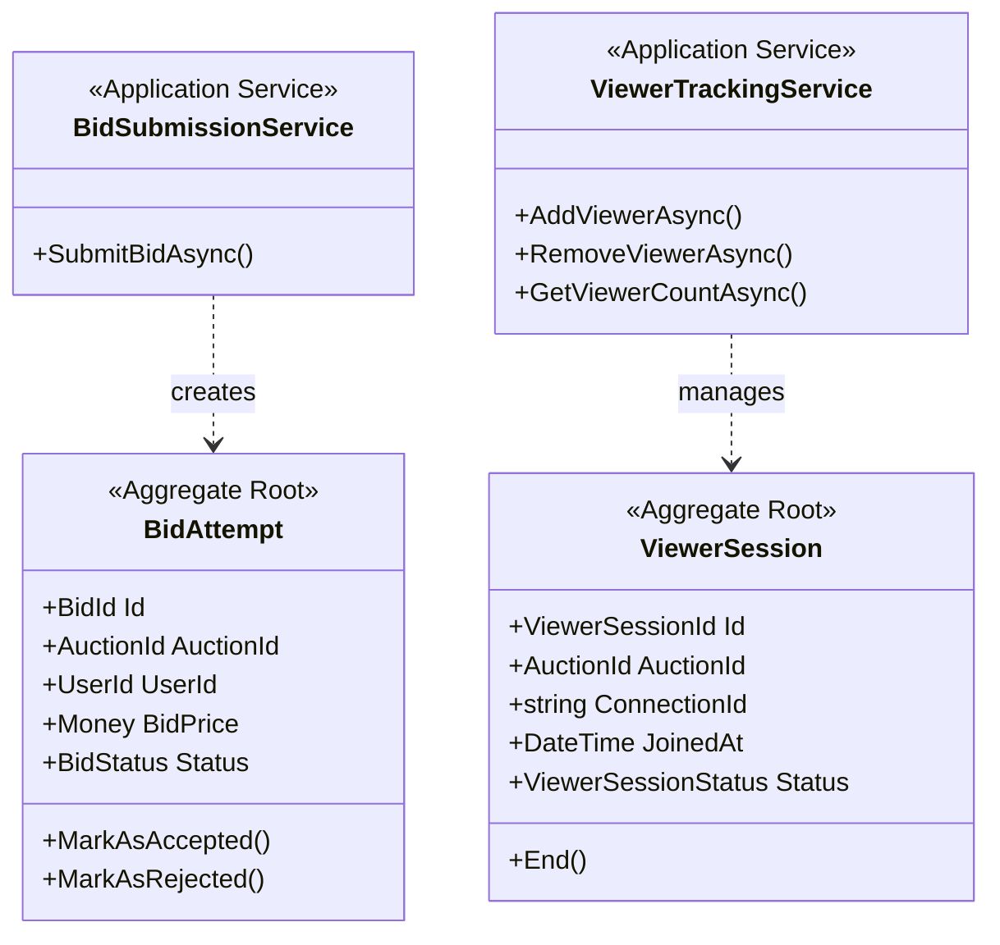

# Bidding Context - Domain Model

## Aggregates

### BidAttempt (Aggregate Root)

**Responsibility**: Reprezentacja próby złożenia bida przez użytkownika

```csharp
public sealed class BidAttempt : AggregateRoot<BidId>
{
    public AuctionId AuctionId { get; private set; }
    public UserId UserId { get; private set; }
    public Money BidPrice { get; private set; }
    public DateTime PlacedAt { get; private set; }
    
    public BidStatus Status { get; private set; }
    public string? RejectionReason { get; private set; }
    public DateTime? ProcessedAt { get; private set; }
    
    // If accepted
    public InventoryItemId? WonItemId { get; private set; }
    public ReservationId? ReservationId { get; private set; }
    
    // Factory
    public static BidAttempt Create(
        BidId bidId,
        AuctionId auctionId,
        UserId userId,
        Money bidPrice);
    
    // Commands (triggered by events from Auction Context)
    public void MarkAsAccepted(
        InventoryItemId wonItemId,
        ReservationId reservationId);
    
    public void MarkAsRejected(string reason);
    
    // Queries
    public bool IsAccepted() => Status == BidStatus.Accepted;
    public bool IsRejected() => Status == BidStatus.Rejected;
    public bool IsPending() => Status == BidStatus.Pending;
}
```

**Invariants**:
- BidPrice must be positive
- Cannot change status from Accepted/Rejected back to Pending
- RejectionReason required when rejected

**Domain Events**:
- `BidAttemptCreated`
- `BidAttemptAccepted`
- `BidAttemptRejected`

---

### ViewerSession (Aggregate Root)

**Responsibility**: Reprezentacja sesji użytkownika oglądającego aukcję

```csharp
public sealed class ViewerSession : AggregateRoot<ViewerSessionId>
{
    public AuctionId AuctionId { get; private set; }
    public UserId? UserId { get; private set; } // Null if anonymous
    public string ConnectionId { get; private set; } // SignalR connection ID
    public DateTime JoinedAt { get; private set; }
    public DateTime? LeftAt { get; private set; }
    public ViewerSessionStatus Status { get; private set; }
    
    // Factory
    public static ViewerSession Start(
        AuctionId auctionId,
        string connectionId,
        UserId? userId = null);
    
    // Commands
    public void End();
    
    public void MarkAsTimeout(); // Connection lost
    
    // Queries
    public bool IsActive() => Status == ViewerSessionStatus.Active;
    public TimeSpan Duration() => (LeftAt ?? DateTime.UtcNow) - JoinedAt;
}
```

**Invariants**:
- ConnectionId must be unique
- Cannot end session twice
- JoinedAt must be before LeftAt

**Domain Events**:
- `ViewerSessionStarted`
- `ViewerSessionEnded`
- `ViewerSessionTimeout`

---

## Value Objects

### BidId

```csharp
public sealed class BidId : ValueObject
{
    public Guid Value { get; }
    
    private BidId(Guid value)
    {
        if (value == Guid.Empty)
            throw new DomainException("BID_ID_EMPTY", "BidId cannot be empty");
        
        Value = value;
    }
    
    public static BidId Create();
    public static BidId From(Guid value);
}
```

**Note**: BidId może być w Shared Kernel jeśli używany przez Auction Context

---

### ViewerSessionId

```csharp
public sealed class ViewerSessionId : ValueObject
{
    public Guid Value { get; }
    
    public static ViewerSessionId Create();
    public static ViewerSessionId From(Guid value);
}
```

---

## Enums

### BidStatus

```csharp
public enum BidStatus
{
    Pending,   // Submitted, waiting for Auction Context response
    Accepted,  // Bid accepted, item won
    Rejected   // Bid rejected (price mismatch, no availability, etc.)
}
```

### ViewerSessionStatus

```csharp
public enum ViewerSessionStatus
{
    Active,     // Currently viewing
    Ended,      // Gracefully left
    Timeout     // Connection lost
}
```

---

## Read Models (CQRS Query Side)

### ActiveViewersReadModel

**Purpose**: Fast queries dla viewer count per auction

```csharp
public class ActiveViewersReadModel
{
    public Guid AuctionId { get; set; }
    public int ActiveViewersCount { get; set; }
    public DateTime LastUpdated { get; set; }
    
    // Built from ViewerSessionStarted/Ended events
}
```

**Storage**: Redis dla real-time performance

```csharp
public interface IActiveViewersQuery
{
    Task<int> GetActiveViewersCountAsync(AuctionId auctionId);
    Task<List<ViewerSession>> GetActiveViewersAsync(AuctionId auctionId);
}
```

---

### BidHistoryReadModel

**Purpose**: Query bid history dla analytics/transparency

```csharp
public class BidHistoryReadModel
{
    public Guid BidId { get; set; }
    public Guid AuctionId { get; set; }
    public Guid UserId { get; set; }
    public decimal BidPrice { get; set; }
    public string Status { get; set; }
    public DateTime PlacedAt { get; set; }
    public DateTime? ProcessedAt { get; set; }
    
    // Built from BidAttempt events
}
```

**Storage**: Azure SQL lub Cosmos DB

```csharp
public interface IBidHistoryQuery
{
    Task<List<BidHistoryReadModel>> GetAuctionBidsAsync(
        AuctionId auctionId, 
        int skip = 0, 
        int take = 50);
    
    Task<List<BidHistoryReadModel>> GetUserBidsAsync(
        UserId userId, 
        int skip = 0, 
        int take = 50);
}
```

---

## Application Services

### BidSubmissionService

**Responsibility**: Orchestrate bid submission flow

```csharp
public sealed class BidSubmissionService
{
    private readonly IBidAttemptRepository _repository;
    private readonly ICommandBus _commandBus;
    private readonly IHubContext<AuctionHub> _hubContext;
    
    public async Task<BidSubmissionResult> SubmitBidAsync(
        BidId bidId,
        AuctionId auctionId,
        UserId userId,
        Money bidPrice)
    {
        // Check idempotency
        var existing = await _repository.GetByIdAsync(bidId);
        if (existing != null)
        {
            return new BidSubmissionResult
            {
                BidId = bidId,
                Status = existing.Status,
                Message = "Bid already submitted"
            };
        }
        
        // Create bid attempt
        var bidAttempt = BidAttempt.Create(bidId, auctionId, userId, bidPrice);
        await _repository.SaveAsync(bidAttempt);
        
        // Send command to Auction Context
        await _commandBus.SendAsync(new AcceptBidCommand
        {
            BidId = bidId,
            AuctionId = auctionId,
            UserId = userId,
            BidPrice = bidPrice,
            PlacedAt = DateTime.UtcNow
        });
        
        // Notify other viewers (optimistic)
        await _hubContext.Clients
            .Group($"auction-{auctionId}")
            .SendAsync("BidSubmitted", new
            {
                AuctionId = auctionId,
                BidPrice = bidPrice.Amount
            });
        
        return new BidSubmissionResult
        {
            BidId = bidId,
            Status = BidStatus.Pending,
            Message = "Bid submitted"
        };
    }
}
```

---

### ViewerTrackingService

**Responsibility**: Track active viewers per auction

```csharp
public sealed class ViewerTrackingService
{
    private readonly IConnectionMultiplexer _redis;
    private readonly IViewerSessionRepository _repository;
    private readonly IHubContext<AuctionHub> _hubContext;
    
    public async Task AddViewerAsync(
        AuctionId auctionId,
        string connectionId,
        UserId? userId = null)
    {
        // Create session
        var session = ViewerSession.Start(auctionId, connectionId, userId);
        await _repository.SaveAsync(session);
        
        // Track in Redis (fast in-memory)
        var key = $"auction:{auctionId}:viewers";
        await _redis.GetDatabase().SetAddAsync(key, connectionId);
        
        // Get updated count
        var count = await GetViewerCountAsync(auctionId);
        
        // Broadcast to all viewers
        await _hubContext.Clients
            .Group($"auction-{auctionId}")
            .SendAsync("ViewerCountUpdated", new
            {
                AuctionId = auctionId,
                ActiveViewers = count
            });
    }
    
    public async Task RemoveViewerAsync(AuctionId auctionId, string connectionId)
    {
        // End session
        var session = await _repository.GetByConnectionIdAsync(connectionId);
        if (session != null)
        {
            session.End();
            await _repository.SaveAsync(session);
        }
        
        // Remove from Redis
        var key = $"auction:{auctionId}:viewers";
        await _redis.GetDatabase().SetRemoveAsync(key, connectionId);
        
        // Get updated count
        var count = await GetViewerCountAsync(auctionId);
        
        // Broadcast update
        await _hubContext.Clients
            .Group($"auction-{auctionId}")
            .SendAsync("ViewerCountUpdated", new
            {
                AuctionId = auctionId,
                ActiveViewers = count
            });
    }
    
    public async Task<int> GetViewerCountAsync(AuctionId auctionId)
    {
        var key = $"auction:{auctionId}:viewers";
        return (int)await _redis.GetDatabase().SetLengthAsync(key);
    }
}
```

---

## Domain Diagram



---

## Event Handlers

### BidAccepted Event Handler (from Auction Context)

```csharp
public class BidAcceptedEventHandler : IEventHandler<BidAccepted>
{
    public async Task HandleAsync(BidAccepted @event)
    {
        // Update bid attempt
        var bidAttempt = await _repository.GetByIdAsync(@event.BidId);
        bidAttempt.MarkAsAccepted(@event.ItemId, @event.ReservationId);
        await _repository.SaveAsync(bidAttempt);
        
        // Notify winner via SignalR
        await _hubContext.Clients
            .User(@event.WinnerId.ToString())
            .SendAsync("BidAccepted", new
            {
                BidId = @event.BidId,
                WinningPrice = @event.WinningPrice,
                ReservationId = @event.ReservationId,
                Message = "Congratulations! You won the item."
            });
        
        // Notify other viewers
        await _hubContext.Clients
            .GroupExcept($"auction-{@event.AuctionId}", @event.WinnerId.ToString())
            .SendAsync("ItemSold", new
            {
                AuctionId = @event.AuctionId,
                Message = "Item was just sold to another buyer"
            });
    }
}
```

### BidRejected Event Handler (from Auction Context)

```csharp
public class BidRejectedEventHandler : IEventHandler<BidRejected>
{
    public async Task HandleAsync(BidRejected @event)
    {
        // Update bid attempt
        var bidAttempt = await _repository.GetByIdAsync(@event.BidId);
        bidAttempt.MarkAsRejected(@event.RejectionReason);
        await _repository.SaveAsync(bidAttempt);
        
        // Notify bidder
        await _hubContext.Clients
            .User(@event.UserId.ToString())
            .SendAsync("BidRejected", new
            {
                BidId = @event.BidId,
                Reason = @event.RejectionReason,
                Message = "Your bid was not accepted. Please try again."
            });
    }
}
```

---

## Validation Rules

### At Bid Submission
- BidId must be unique (idempotency)
- UserId must be authenticated
- BidPrice must be positive
- AuctionId must reference active auction

### At Viewer Tracking
- ConnectionId must be unique
- Cannot join same auction twice with same connection
- Session must be active to end

---

## Performance Considerations

### Redis for Viewer Tracking
- Set operations: O(1)
- SetLength: O(1)
- Perfect dla real-time counting

### Bid Idempotency Check
- Index on BidId dla fast lookup
- Typical response: < 10ms

### SignalR Scalability
- Azure SignalR Service handles 100,000+ connections
- Automatic load balancing
- No sticky sessions required
