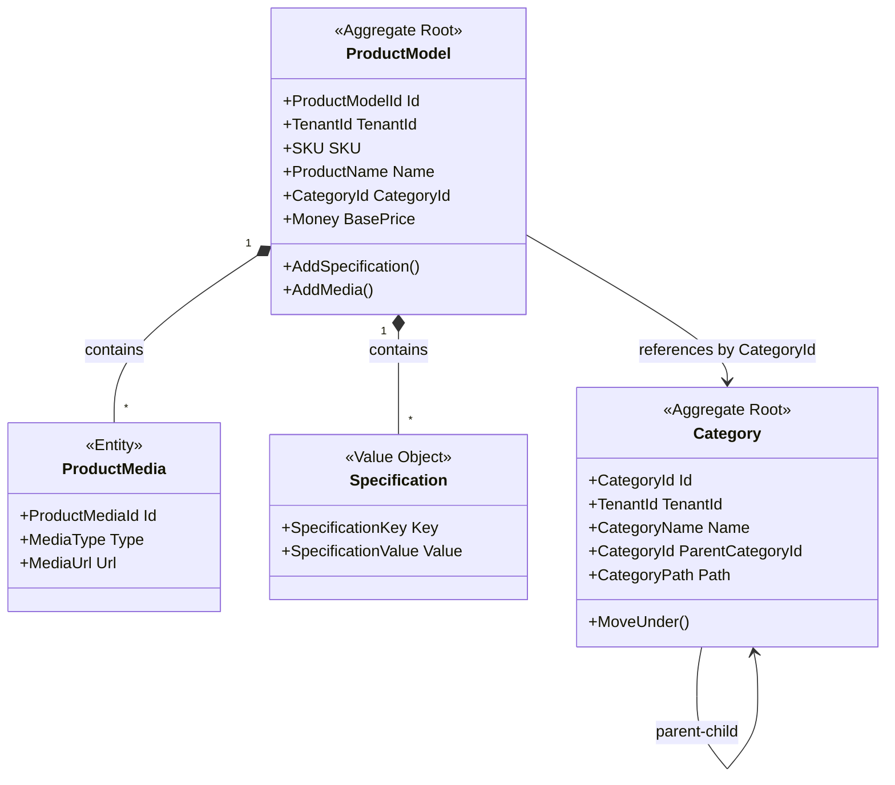

# Product Catalog Context - Domain Model

## Aggregates

### ProductModel (Aggregate Root)

**Responsibility**: Reprezentacja "klasy" produktu - modelu bez odniesienia do konkretnego egzemplarza

```csharp
public sealed class ProductModel : AggregateRoot<ProductModelId>
{
    public TenantId TenantId { get; private set; }
    public SKU SKU { get; private set; }
    public ProductName Name { get; private set; }
    public ProductDescription Description { get; private set; }
    public CategoryId CategoryId { get; private set; }
    public Money BasePrice { get; private set; }
    public ProductStatus Status { get; private set; }
    
    private readonly List<Specification> _specifications = new();
    public IReadOnlyCollection<Specification> Specifications => _specifications.AsReadOnly();
    
    private readonly List<ProductMedia> _media = new();
    public IReadOnlyCollection<ProductMedia> Media => _media.AsReadOnly();
    
    public ProductMediaId? MainImageId { get; private set; }
    
    // Factory
    public static ProductModel Create(
        TenantId tenantId,
        SKU sku,
        ProductName name,
        ProductDescription description,
        CategoryId categoryId,
        Money basePrice);
    
    // Commands
    public void UpdateDetails(
        ProductName name, 
        ProductDescription description);
    
    public void ChangeCategory(CategoryId newCategoryId);
    
    public void UpdateBasePrice(Money newPrice);
    
    public void AddSpecification(SpecificationKey key, SpecificationValue value);
    
    public void RemoveSpecification(SpecificationKey key);
    
    public void AddMedia(ProductMedia media);
    
    public void SetMainImage(ProductMediaId mediaId);
    
    public void Archive();
    
    public void Activate();
    
    // Invariants
    private void EnsureActive(); // Throws if Status != Active
    private void EnsureMediaExists(ProductMediaId mediaId);
}
```

**Invariants**:
- SKU must be unique per tenant
- BasePrice must be positive
- MainImage must reference existing media
- Cannot modify archived ProductModel (except Activate)
- CategoryId must reference existing Category

**Domain Events**:
- `ProductModelCreated`
- `ProductModelDetailsUpdated`
- `ProductModelCategorized`
- `ProductModelPriceChanged`
- `SpecificationAdded`
- `SpecificationRemoved`
- `ProductMediaAdded`
- `MainImageChanged`
- `ProductModelArchived`
- `ProductModelActivated`

---

### Category (Aggregate Root)

**Responsibility**: Węzeł w hierarchii kategorii produktów

```csharp
public sealed class Category : AggregateRoot<CategoryId>
{
    public TenantId TenantId { get; private set; }
    public CategoryName Name { get; private set; }
    public CategoryId? ParentCategoryId { get; private set; }
    public CategoryPath Path { get; private set; } // e.g., "/Electronics/TV/OLED"
    public int Level { get; private set; } // 0 = root, 1 = child, etc.
    public CategoryStatus Status { get; private set; }
    public int DisplayOrder { get; private set; }
    
    // Factory
    public static Category CreateRoot(
        TenantId tenantId,
        CategoryName name);
    
    public static Category CreateChild(
        TenantId tenantId,
        CategoryName name,
        CategoryId parentCategoryId,
        CategoryPath parentPath);
    
    // Commands
    public void Rename(CategoryName newName);
    
    public void MoveUnder(
        CategoryId? newParentId, 
        CategoryPath newParentPath);
    
    public void ChangeDisplayOrder(int newOrder);
    
    public void Deactivate();
    
    public void Activate();
    
    // Invariants
    private void EnsureNotCircularReference(CategoryId potentialParentId);
    private void EnsureMaxDepth(int newLevel); // Max 5 levels
}
```

**Invariants**:
- Category name unique per parent (sibling uniqueness)
- No circular references in hierarchy
- Max hierarchy depth: 5 levels
- Cannot deactivate category with active ProductModels
- Path must match hierarchy structure

**Domain Events**:
- `CategoryCreated`
- `CategoryRenamed`
- `CategoryMoved`
- `CategoryDisplayOrderChanged`
- `CategoryDeactivated`
- `CategoryActivated`

---

## Entities

### ProductMedia (Entity)

**Responsibility**: Multimedialna reprezentacja produktu (zdjęcie, wideo)

```csharp
public sealed class ProductMedia : Entity<ProductMediaId>
{
    public MediaType Type { get; private set; }
    public MediaUrl Url { get; private set; }
    public MediaUrl? ThumbnailUrl { get; private set; }
    public string? AltText { get; private set; }
    public int DisplayOrder { get; private set; }
    
    internal static ProductMedia Create(
        MediaType type,
        MediaUrl url,
        MediaUrl? thumbnailUrl,
        string? altText,
        int displayOrder);
    
    internal void ChangeDisplayOrder(int newOrder);
}
```

---

## Value Objects

### SKU

```csharp
public sealed class SKU : ValueObject
{
    public string Value { get; }
    
    private SKU(string value)
    {
        // Invariants:
        // - Not null or empty
        // - Max 50 characters
        // - Alphanumeric + dash/underscore
        // - No whitespace
        Value = value;
    }
    
    public static SKU From(string value);
    
    protected override IEnumerable<object> GetEqualityComponents()
    {
        yield return Value;
    }
}
```

### ProductName

```csharp
public sealed class ProductName : ValueObject
{
    public string Value { get; }
    
    private ProductName(string value)
    {
        // Invariants:
        // - Not null or empty
        // - 3-200 characters
        // - No leading/trailing whitespace
        Value = value;
    }
    
    public static ProductName From(string value);
}
```

### ProductDescription

```csharp
public sealed class ProductDescription : ValueObject
{
    public string Value { get; }
    
    private ProductDescription(string value)
    {
        // Invariants:
        // - Can be empty (optional)
        // - Max 5000 characters
        // - Sanitized HTML (no script tags)
        Value = value;
    }
    
    public static ProductDescription From(string value);
    public static ProductDescription Empty();
}
```

### Specification

```csharp
public sealed class Specification : ValueObject
{
    public SpecificationKey Key { get; }
    public SpecificationValue Value { get; }
    
    private Specification(SpecificationKey key, SpecificationValue value)
    {
        Key = key;
        Value = value;
    }
    
    public static Specification Create(SpecificationKey key, SpecificationValue value);
}
```

### SpecificationKey

```csharp
public sealed class SpecificationKey : ValueObject
{
    public string Value { get; }
    
    private SpecificationKey(string value)
    {
        // Invariants:
        // - 1-100 characters
        // - No special characters except space/dash
        Value = value;
    }
    
    public static SpecificationKey From(string value);
}
```

### SpecificationValue

```csharp
public sealed class SpecificationValue : ValueObject
{
    public string Value { get; }
    
    private SpecificationValue(string value)
    {
        // Invariants:
        // - 1-500 characters
        Value = value;
    }
    
    public static SpecificationValue From(string value);
}
```

### CategoryName

```csharp
public sealed class CategoryName : ValueObject
{
    public string Value { get; }
    
    private CategoryName(string value)
    {
        // Invariants:
        // - 1-100 characters
        // - No leading/trailing whitespace
        Value = value;
    }
    
    public static CategoryName From(string value);
}
```

### CategoryPath

```csharp
public sealed class CategoryPath : ValueObject
{
    public string Value { get; } // e.g., "/Electronics/TV/OLED"
    
    private CategoryPath(string value)
    {
        // Invariants:
        // - Starts with /
        // - Valid path segments
        // - Max depth 5
        Value = value;
    }
    
    public static CategoryPath Root();
    public static CategoryPath From(string value);
    public CategoryPath AppendSegment(string segment);
    public CategoryPath GetParentPath();
    public int GetDepth();
}
```

### MediaUrl

```csharp
public sealed class MediaUrl : ValueObject
{
    public string Value { get; }
    
    private MediaUrl(string value)
    {
        // Invariants:
        // - Valid URL format
        // - HTTPS only
        // - Max 2000 characters
        Value = value;
    }
    
    public static MediaUrl From(string value);
}
```

---

## Enums

### ProductStatus

```csharp
public enum ProductStatus
{
    Draft,      // Work in progress
    Active,     // Available for creating auctions
    Archived    // No longer available
}
```

### CategoryStatus

```csharp
public enum CategoryStatus
{
    Active,
    Inactive
}
```

### MediaType

```csharp
public enum MediaType
{
    Image,
    Video,
    Document // For spec sheets, manuals
}
```

---

## Domain Services

### CategoryHierarchyService

**Responsibility**: Walidacja i zarządzanie złożoną logiką hierarchii kategorii

```csharp
public sealed class CategoryHierarchyService
{
    // Validates that moving category won't create circular reference
    public bool WouldCreateCircularReference(
        CategoryId categoryToMove, 
        CategoryId newParentId);
    
    // Calculates new path after moving category
    public CategoryPath CalculateNewPath(
        CategoryId categoryToMove,
        CategoryId? newParentId,
        CategoryPath? newParentPath);
    
    // Gets all descendant categories (for bulk operations)
    public IEnumerable<CategoryId> GetDescendants(CategoryId categoryId);
}
```

**Note**: Domain service jest potrzebny, bo operacje wymagają knowledge o innych agreggatach

---

## Diagram: Aggregate Structure



---

## Validation Rules

### At Aggregate Creation
- TenantId must reference existing active tenant
- SKU must be unique per tenant
- CategoryId must reference existing active category
- BasePrice must be positive

### At Aggregate Modification
- Cannot modify archived ProductModel (except to activate)
- Cannot change SKU after creation (immutable)
- Cannot assign to inactive category
- Specifications: max 50 per product
- Media: max 20 per product

### Cross-Aggregate Rules (Domain Services)
- Category cannot be deleted if has assigned ProductModels
- Category hierarchy: max 5 levels deep
- No circular references in category tree
