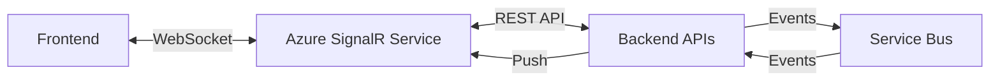

# Real-time Updates Strategy

## Overview

Real-time bidirectional communication między backend a frontend dla immediate feedback podczas aukcji.

## Why Real-time?

1. **Price Updates**: Cena spada co sekundę, users muszą widzieć current price
2. **Bid Notifications**: Instant feedback na bid acceptance/rejection
3. **Viewer Count**: Live count ile osób ogląda aukcję
4. **Sold Notifications**: "Someone just bought this!" alerts

---

## SignalR Architecture

### Azure SignalR Service

**Why Azure SignalR Service (nie self-hosted)**:
- Handles 100,000+ concurrent connections
- Auto-scaling
- No sticky sessions required
- Managed service (less ops overhead)
- Geographic distribution



---

## Hub Implementation

### AuctionHub

```csharp
[Authorize] // Optional: require authentication
public class AuctionHub : Hub
{
    private readonly IViewerTrackingService _viewerTracking;
    private readonly IAuctionRepository _auctionRepository;
    
    // Client joins auction group
    public async Task JoinAuction(Guid auctionId)
    {
        await Groups.AddToGroupAsync(Context.ConnectionId, $"auction-{auctionId}");
        
        // Track viewer
        var userId = Context.User?.Identity?.IsAuthenticated == true
            ? UserId.From(Guid.Parse(Context.UserIdentifier))
            : null;
        
        await _viewerTracking.AddViewerAsync(
            AuctionId.From(auctionId),
            Context.ConnectionId,
            userId);
        
        // Send initial auction state
        var auction = await _auctionRepository.GetByIdAsync(AuctionId.From(auctionId));
        await Clients.Caller.SendAsync("AuctionState", new
        {
            AuctionId = auctionId,
            CurrentPrice = auction.CalculateCurrentPrice(DateTime.UtcNow).Amount,
            RemainingItems = auction.RemainingItemsCount,
            ActiveViewers = await _viewerTracking.GetViewerCountAsync(AuctionId.From(auctionId))
        });
    }
    
    // Client leaves auction
    public async Task LeaveAuction(Guid auctionId)
    {
        await Groups.RemoveFromGroupAsync(Context.ConnectionId, $"auction-{auctionId}");
        
        await _viewerTracking.RemoveViewerAsync(
            AuctionId.From(auctionId),
            Context.ConnectionId);
    }
    
    // Handle disconnection
    public override async Task OnDisconnectedAsync(Exception? exception)
    {
        await _viewerTracking.HandleDisconnectAsync(Context.ConnectionId);
        await base.OnDisconnectedAsync(exception);
    }
}
```

---

## Frontend Integration

### React Hook for SignalR

```typescript
import { HubConnection, HubConnectionBuilder } from '@microsoft/signalr';

export function useAuctionHub(auctionId: string) {
  const [connection, setConnection] = useState<HubConnection | null>(null);
  const [currentPrice, setCurrentPrice] = useState<number>(0);
  const [activeViewers, setActiveViewers] = useState<number>(0);
  
  useEffect(() => {
    // Create connection
    const newConnection = new HubConnectionBuilder()
      .withUrl('https://api.platform.com/hubs/auction', {
        accessTokenFactory: () => getAuthToken()
      })
      .withAutomaticReconnect()
      .build();
    
    // Setup event handlers
    newConnection.on('PriceUpdated', (data) => {
      setCurrentPrice(data.currentPrice);
    });
    
    newConnection.on('ViewerCountUpdated', (data) => {
      setActiveViewers(data.activeViewers);
    });
    
    newConnection.on('ItemSold', (data) => {
      showNotification('Item was just sold!');
    });
    
    newConnection.on('BidAccepted', (data) => {
      // Redirect to checkout
      router.push(`/checkout/${data.reservationId}`);
    });
    
    newConnection.on('BidRejected', (data) => {
      showError(data.reason);
    });
    
    // Start connection
    newConnection.start()
      .then(() => {
        console.log('SignalR connected');
        newConnection.invoke('JoinAuction', auctionId);
      })
      .catch(err => console.error('SignalR connection error:', err));
    
    setConnection(newConnection);
    
    // Cleanup
    return () => {
      if (newConnection) {
        newConnection.invoke('LeaveAuction', auctionId);
        newConnection.stop();
      }
    };
  }, [auctionId]);
  
  // Method to place bid
  const placeBid = async (bidPrice: number) => {
    // Use REST API for commands, not SignalR
    await axios.post(`/api/auctions/${auctionId}/bids`, {
      bidPrice: bidPrice
    });
    
    // Response will come via SignalR (BidAccepted/BidRejected)
  };
  
  return {
    currentPrice,
    activeViewers,
    placeBid,
    isConnected: connection?.state === 'Connected'
  };
}
```

---

## Event Broadcasting

### From Event Handlers to SignalR

```csharp
public class PriceDroppedEventHandler : IEventHandler<PriceDropped>
{
    private readonly IHubContext<AuctionHub> _hubContext;
    
    public async Task HandleAsync(PriceDropped @event)
    {
        // Broadcast to all clients in auction group
        await _hubContext.Clients
            .Group($"auction-{@event.AuctionId}")
            .SendAsync("PriceUpdated", new
            {
                AuctionId = @event.AuctionId,
                CurrentPrice = @event.CurrentPrice,
                Currency = @event.Currency,
                DropsRemaining = @event.DropsRemaining
            });
    }
}
```

### Broadcasting Patterns

**To specific user** (winner notification):
```csharp
await _hubContext.Clients
    .User(userId.ToString())
    .SendAsync("BidAccepted", data);
```

**To all in group** (price update):
```csharp
await _hubContext.Clients
    .Group($"auction-{auctionId}")
    .SendAsync("PriceUpdated", data);
```

**To all except user** (other viewers):
```csharp
await _hubContext.Clients
    .GroupExcept($"auction-{auctionId}", userId.ToString())
    .SendAsync("ItemSold", data);
```

---

## Message Types

### Server → Client

#### PriceUpdated
```typescript
{
  auctionId: string,
  currentPrice: number,
  currency: string,
  dropsRemaining: number
}
```

#### ViewerCountUpdated
```typescript
{
  auctionId: string,
  activeViewers: number
}
```

#### BidAccepted (to winner)
```typescript
{
  bidId: string,
  winningPrice: number,
  reservationId: string,
  expiresAt: string
}
```

#### BidRejected (to bidder)
```typescript
{
  bidId: string,
  reason: string,
  currentPrice: number
}
```

#### ItemSold
```typescript
{
  auctionId: string,
  remainingItems: number
}
```

#### AuctionEnded
```typescript
{
  auctionId: string,
  reason: string
}
```

---

## Scalability Considerations

### Azure SignalR Service Tiers

**Free**: 20 concurrent connections (dev/test)
**Standard**: Up to 100K connections per unit
**Premium**: Enhanced availability, better performance

**For MVP**: Standard S1 (1000 concurrent connections)

### Connection Management

```csharp
// Graceful reconnection
const connection = new HubConnectionBuilder()
  .withUrl(hubUrl)
  .withAutomaticReconnect({
    nextRetryDelayInMilliseconds: retryContext => {
      // Exponential backoff: 0s, 2s, 10s, 30s, then every 30s
      if (retryContext.previousRetryCount === 0) return 0;
      if (retryContext.previousRetryCount === 1) return 2000;
      if (retryContext.previousRetryCount === 2) return 10000;
      return 30000;
    }
  })
  .build();
```

### Message Throttling

```csharp
// Don't spam price updates - send max once per 5 seconds
public class ThrottledPriceUpdater
{
    private readonly Dictionary<Guid, DateTime> _lastUpdate = new();
    private readonly TimeSpan _throttleInterval = TimeSpan.FromSeconds(5);
    
    public bool ShouldSendUpdate(Guid auctionId)
    {
        if (!_lastUpdate.TryGetValue(auctionId, out var lastTime))
        {
            _lastUpdate[auctionId] = DateTime.UtcNow;
            return true;
        }
        
        if (DateTime.UtcNow - lastTime >= _throttleInterval)
        {
            _lastUpdate[auctionId] = DateTime.UtcNow;
            return true;
        }
        
        return false;
    }
}
```

---

## Fallback Strategy

### Graceful Degradation

```typescript
// If SignalR disconnected, fall back to polling
useEffect(() => {
  let pollInterval: NodeJS.Timeout;
  
  if (!isConnected) {
    // Poll current price every 5 seconds
    pollInterval = setInterval(async () => {
      const price = await fetchCurrentPrice(auctionId);
      setCurrentPrice(price);
    }, 5000);
  }
  
  return () => clearInterval(pollInterval);
}, [isConnected, auctionId]);
```

---

## Monitoring & Alerts

### Key Metrics

- **Connection Count**: Active SignalR connections
- **Message Rate**: Messages/second
- **Latency**: Time from event → client receives
- **Failed Connections**: Connection errors
- **Reconnection Rate**: How often clients reconnect

### Application Insights

```csharp
// Track custom metrics
_telemetry.TrackMetric("SignalR.ActiveConnections", activeCount);
_telemetry.TrackMetric("SignalR.MessagesSent", messageCount);
_telemetry.TrackEvent("SignalR.ConnectionFailed", properties);
```

---

## Security

### Authentication

```csharp
// Require authentication
[Authorize]
public class AuctionHub : Hub
{
    // User identity available via Context.User
}
```

### Authorization

```csharp
// Check if user can join auction (e.g., tenant membership)
public async Task JoinAuction(Guid auctionId)
{
    var auction = await _repository.GetByIdAsync(AuctionId.From(auctionId));
    var userTenantId = GetUserTenantId();
    
    if (auction.TenantId != userTenantId)
    {
        throw new HubException("Unauthorized");
    }
    
    await Groups.AddToGroupAsync(Context.ConnectionId, $"auction-{auctionId}");
}
```

### Rate Limiting

```csharp
// Prevent abuse (e.g., rapidly joining/leaving)
public class RateLimitAttribute : Attribute
{
    // Implement rate limiting per connection
}
```

---

## Testing

### Unit Test Hub Methods

```csharp
[Fact]
public async Task JoinAuction_AddsToGroup()
{
    // Arrange
    var mockClients = new Mock<IHubCallerClients>();
    var hub = new AuctionHub { Clients = mockClients.Object };
    
    // Act
    await hub.JoinAuction(auctionId);
    
    // Assert
    mockClients.Verify(x => x.Group($"auction-{auctionId}"), Times.Once);
}
```

### Integration Test SignalR Flow

```typescript
// E2E test
test('receives price update after join', async () => {
  const connection = await connectToHub();
  await connection.invoke('JoinAuction', auctionId);
  
  const priceUpdate = await waitForMessage('PriceUpdated', 5000);
  
  expect(priceUpdate.auctionId).toBe(auctionId);
  expect(priceUpdate.currentPrice).toBeGreaterThan(0);
});
```
