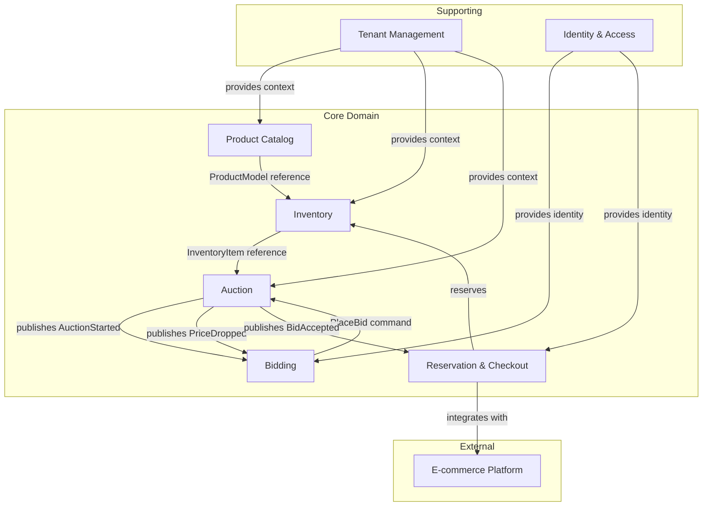

# Bounded Contexts Overview

## Context Map

## Relationships & Integration Patterns

### Product Catalog → Inventory
**Pattern**: Shared Reference (ProductModelId)
- Inventory Context trzyma reference do ProductModelId
- Nie duplikuje szczegółów produktu
- Query side może denormalizować dla performance

### Inventory → Auction
**Pattern**: Shared Reference (InventoryItemId) + Event Collaboration
- Auction trzyma reference do InventoryItemId
- Inventory publikuje events o zmianie statusu (Reserved, Sold)
- Auction subskrybuje i reaguje na te zmiany

### Auction → Bidding
**Pattern**: Event Collaboration
- Auction publikuje domain events (AuctionStarted, PriceDropped, AuctionEnded)
- Bidding Context subskrybuje i obsługuje logikę bidowania
- Real-time updates przez SignalR/WebSocket

### Bidding → Auction
**Pattern**: Command
- Bidding wysyła PlaceBid command do Auction
- Auction waliduje i akceptuje/odrzuca
- Response przez domain event (BidAccepted/BidRejected)

### Auction → Reservation
**Pattern**: Event Collaboration
- Auction publikuje BidAccepted event
- Reservation Context tworzy reservation
- Rozpoczyna checkout flow

### Reservation → Inventory
**Pattern**: Command + Event
- Reservation wysyła ReserveItem command do Inventory
- Inventory zmienia status i publikuje ItemReserved event

### Reservation → E-commerce Platform
**Pattern**: Anti-Corruption Layer
- Adapter translateuje nasze domain model na API e-commerce
- Może być różny adapter per tenant (różne platformy)

### Tenant Management → All Core Contexts
**Pattern**: Shared Kernel
- TenantId jako shared value object
- Każdy BC musi operować w kontekście tenanta
- Tenant Configuration dostępna jako read model

## Context Descriptions

### Product Catalog Context
**Type**: Core Domain
**Responsibility**: Zarządzanie katalogiem modeli produktów
- Definicje "klas" produktów (np. Samsung XC1575C)
- Specyfikacje techniczne, opisy, zdjęcia
- Hierarchia kategorii per tenant
- Branding i customization produktów

**Key Concepts**: ProductModel, Category, Specification

---

### Inventory Context
**Type**: Core Domain
**Responsibility**: Zarządzanie konkretnymi egzemplarzami produktów
- Tracking fizycznych itemów (serial numbers, condition)
- Stan dostępności (available, reserved, sold)
- Powiązanie z ProductModel
- Multi-tenant isolation

**Key Concepts**: InventoryItem, ItemCondition, Availability

---

### Auction Context
**Type**: Core Domain - **HEART OF THE SYSTEM**
**Responsibility**: Mechanizm aukcji odwrotnej
- Lifecycle aukcji (Draft → Scheduled → Published → Ended)
- Time-based price calculation (on-the-fly based on schedule)
- Price drop mechanism (precyzyjny co do sekundy)
- Linking multiple InventoryItems to single auction
- Bid validation (czy cena w zakresie, czy item dostępny)

**Key Concepts**: Auction, PriceSchedule, AuctionStatus, CurrentPrice

---

### Bidding Context
**Type**: Core Domain
**Responsibility**: Proces składania ofert zakupu
- Placement bida przez użytkownika
- Walidacja bida z aktualną ceną aukcji
- Winner selection przy multi-item auctions
- Real-time notifications (kto kupił, ile osób ogląda)

**Key Concepts**: Bid, BidValidation, ViewerTracking

---

### Reservation & Checkout Context
**Type**: Core Domain
**Responsibility**: Rezerwacja i przekazanie do checkout
- Rezerwacja wygranego itemu (z timeout)
- Integracja z e-commerce platform sprzedawcy
- Przekazanie do koszyka z odpowiednim rabatem
- Handling expired reservations

**Key Concepts**: Reservation, CheckoutSession, ReservationExpiry

---

### Tenant Management Context
**Type**: Supporting Domain
**Responsibility**: Zarządzanie tenantami (sprzedawcami)
- Konfiguracja tenanta (branding, subdomena)
- Hierarchia kategorii per tenant
- Settings i customization
- Status tenanta (active, suspended)

**Key Concepts**: Tenant, TenantConfiguration, CategoryHierarchy

---

### Identity & Access Context
**Type**: Supporting Domain
**Responsibility**: Użytkownicy i autoryzacja
- User accounts (sprzedawcy, kupujący)
- Role i permissions
- Tenant membership
- Authentication tokens

**Key Concepts**: User, Role, TenantMembership

## Data Consistency Patterns

### Strong Consistency (Within Aggregate)
- Wszystko w ramach jednego aggregate root
- ACID transactions
- Przykład: Auction ze swoim PriceSchedule

### Eventual Consistency (Between Aggregates)
- Komunikacja przez domain events
- Event Sourcing dla audit trail (opcjonalne)
- Przykład: Auction → Reservation

### Read Model Denormalization
- CQRS read side może denormalizować dane z wielu BC
- Eventual consistency OK dla queries
- Przykład: AuctionListView z danymi z Auction + Inventory + ProductCatalog

## Anti-Patterns to Avoid

❌ **Distributed Transactions** - nie używamy 2PC między BC
❌ **Shared Database** - każdy BC ma swoją bazę (logical separation minimum)
❌ **Synchronous Coupling** - BC nie callują się nawzajem synchronicznie (wyjątek: queries)
❌ **God Aggregate** - aggregate nie może być zbyt duży (max ~10 entities)
❌ **Anemic Domain Model** - business logic musi być w domain, nie w application services
