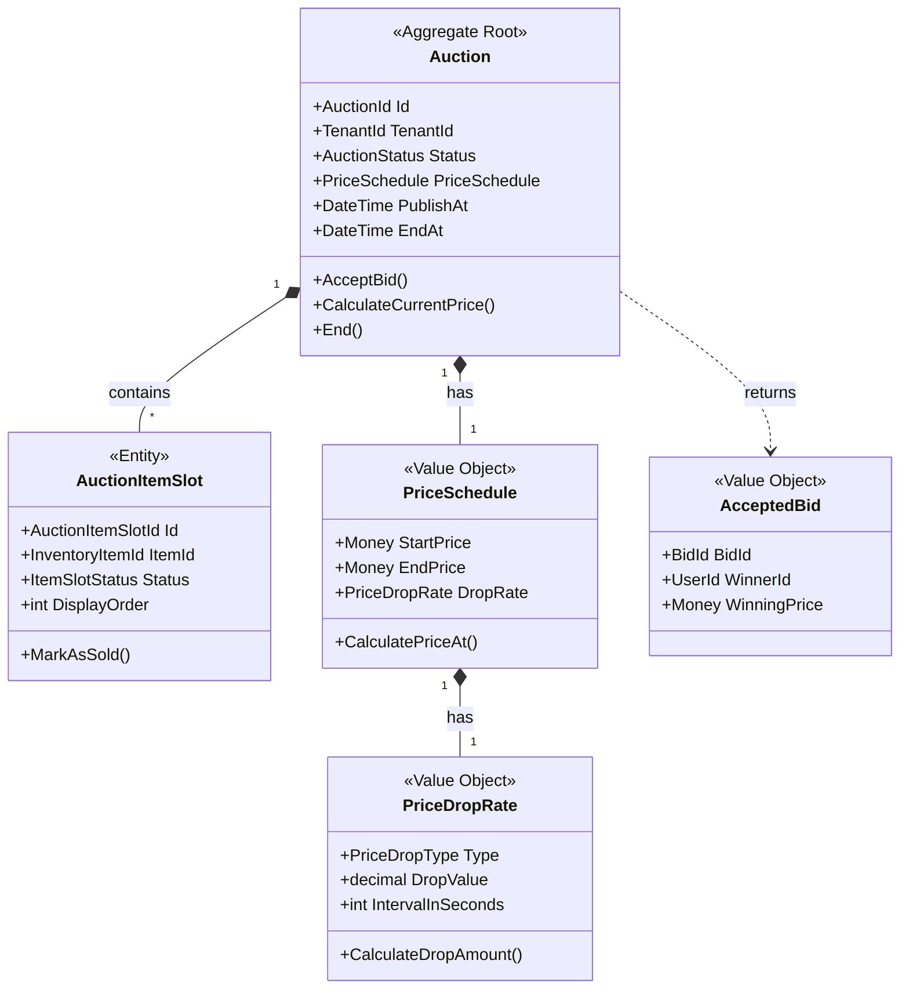

# Auction Context - Domain Model

## Aggregates

### Auction (Aggregate Root)

**Responsibility**: Reprezentacja aukcji odwrotnej z time-based price drop dla jednego lub wielu items

```csharp
public sealed class Auction : AggregateRoot<AuctionId>
{
    public TenantId TenantId { get; private set; }
    public AuctionTitle Title { get; private set; }
    public AuctionDescription Description { get; private set; }
    
    public AuctionStatus Status { get; private set; }
    
    // Scheduling
    public DateTime? PublishAt { get; private set; } // Null = publish immediately
    public DateTime? PublishedOn { get; private set; } // Actual publish time
    public DateTime EndAt { get; private set; } // When auction must end
    public DateTime? EndedOn { get; private set; } // Actual end time
    
    // Price Schedule (Embedded Value Object)
    public PriceSchedule PriceSchedule { get; private set; }
    
    // Items in auction
    private readonly List<AuctionItemSlot> _itemSlots = new();
    public IReadOnlyCollection<AuctionItemSlot> ItemSlots => _itemSlots.AsReadOnly();
    
    // Current active slot (sequential auction)
    public int CurrentSlotIndex { get; private set; } // 0-based
    
    // Metadata
    public int TotalItemsCount { get; private set; }
    public int SoldItemsCount { get; private set; }
    public int RemainingItemsCount { get; private set; }
    
    public long Version { get; private set; } // Optimistic locking
    
    // Factory
    public static Auction Create(
        TenantId tenantId,
        AuctionTitle title,
        AuctionDescription description,
        PriceSchedule priceSchedule,
        DateTime endAt,
        DateTime? publishAt = null);
    
    // Commands - Setup Phase (Draft)
    public void AddItem(InventoryItemId itemId, int displayOrder);
    
    public void RemoveItem(InventoryItemId itemId);
    
    public void UpdateDetails(AuctionTitle title, AuctionDescription description);
    
    public void UpdateSchedule(DateTime? publishAt, DateTime endAt);
    
    public void UpdatePriceSchedule(PriceSchedule newSchedule);
    
    // Commands - Publication
    public void Schedule(DateTime publishAt);
    
    public void Publish(); // Immediate or scheduled publish
    
    // Commands - Active Phase
    public Result<AcceptedBid> AcceptBid(
        BidId bidId,
        UserId userId,
        Money bidPrice,
        DateTime bidPlacedAt);
    
    public void Cancel(string reason);
    
    public void End(); // Natural end or manual
    
    // Queries
    public Money CalculateCurrentPrice(DateTime atTime)
    {
        if (Status != AuctionStatus.Published && Status != AuctionStatus.Active)
            throw new InvalidOperationException("Cannot calculate price for non-active auction");
        
        return PriceSchedule.CalculatePriceAt(PublishedOn!.Value, atTime);
    }
    
    public AuctionItemSlot? GetCurrentActiveSlot()
    {
        if (CurrentSlotIndex >= _itemSlots.Count)
            return null;
        
        return _itemSlots[CurrentSlotIndex];
    }
    
    public bool HasAvailableItems() => RemainingItemsCount > 0;
    
    public bool IsActive() => Status == AuctionStatus.Active || Status == AuctionStatus.Published;
    
    public bool HasEnded() => Status == AuctionStatus.Ended || Status == AuctionStatus.Cancelled;
    
    // Invariants
    private void EnsureDraft(); // Only modify in Draft
    
    private void EnsurePublished(); // For bid acceptance
    
    private void EnsureNotEnded();
    
    private void EnsureHasItems(); // At least one item required
    
    private void EnsureValidTimeRange(); // PublishAt < EndAt
    
    private void ValidateBidPrice(Money bidPrice, DateTime bidPlacedAt);
    
    private void MoveToNextSlot(); // After successful bid
}
```

**Invariants**:
- Must have at least one ItemSlot
- PublishAt must be before EndAt
- Cannot modify published/active auction structure
- PriceSchedule: StartPrice > EndPrice
- All items must belong to same tenant
- CurrentSlotIndex must be < TotalItemsCount
- Bid price must be within current price range (±tolerance)

**Domain Events**:
- `AuctionCreated`
- `AuctionItemAdded`
- `AuctionItemRemoved`
- `AuctionScheduled`
- `AuctionPublished`
- `BidPlaced`
- `BidAccepted`
- `BidRejected`
- `ItemSoldInAuction`
- `AuctionEnded`
- `AuctionCancelled`
- `PriceDropped` (periodic - for real-time updates)

---

## Entities

### AuctionItemSlot (Entity)

**Responsibility**: Reprezentacja slotu dla InventoryItem w aukcji

```csharp
public sealed class AuctionItemSlot : Entity<AuctionItemSlotId>
{
    public InventoryItemId InventoryItemId { get; private set; }
    public int DisplayOrder { get; private set; } // Position in queue: 1, 2, 3...
    public ItemSlotStatus Status { get; private set; }
    
    // Winner info (when sold)
    public UserId? WinnerId { get; private set; }
    public Money? WinningPrice { get; private set; }
    public DateTime? SoldAt { get; private set; }
    public BidId? WinningBidId { get; private set; }
    
    internal static AuctionItemSlot Create(
        InventoryItemId inventoryItemId,
        int displayOrder);
    
    internal void MarkAsSold(
        UserId winnerId, 
        Money winningPrice, 
        BidId winningBidId);
    
    internal void MarkAsAvailable(); // If returned to pool
    
    public bool IsAvailable() => Status == ItemSlotStatus.Available;
    
    public bool IsSold() => Status == ItemSlotStatus.Sold;
}
```

---

## Value Objects

### PriceSchedule

**Responsibility**: Konfiguracja mechanizmu spadku ceny

```csharp
public sealed class PriceSchedule : ValueObject
{
    public Money StartPrice { get; }
    public Money EndPrice { get; }
    public PriceDropRate DropRate { get; }
    public TimeSpan Duration { get; } // Total auction duration
    
    private PriceSchedule(
        Money startPrice,
        Money endPrice,
        PriceDropRate dropRate,
        TimeSpan duration)
    {
        // Invariants:
        // - StartPrice > EndPrice
        // - Same currency
        // - DropRate compatible with StartPrice-EndPrice range
        // - Duration > 0
        
        if (startPrice.Amount <= endPrice.Amount)
            throw new DomainException(
                "INVALID_PRICE_RANGE", 
                "Start price must be greater than end price");
        
        if (startPrice.Currency != endPrice.Currency)
            throw new DomainException(
                "CURRENCY_MISMATCH", 
                "Start and end price must have same currency");
        
        StartPrice = startPrice;
        EndPrice = endPrice;
        DropRate = dropRate;
        Duration = duration;
    }
    
    public static PriceSchedule Create(
        Money startPrice,
        Money endPrice,
        PriceDropRate dropRate,
        TimeSpan duration);
    
    // Core calculation method
    public Money CalculatePriceAt(DateTime startTime, DateTime currentTime)
    {
        var elapsed = currentTime - startTime;
        
        // If before start or after duration, use boundary prices
        if (elapsed < TimeSpan.Zero)
            return StartPrice;
        
        if (elapsed >= Duration)
            return EndPrice;
        
        // Calculate price drop based on elapsed time
        var totalPriceDrop = StartPrice.Subtract(EndPrice);
        var dropAmount = DropRate.CalculateDropAmount(elapsed);
        
        var currentPrice = StartPrice.Subtract(dropAmount);
        
        // Ensure price doesn't go below EndPrice
        if (currentPrice.Amount < EndPrice.Amount)
            return EndPrice;
        
        return currentPrice;
    }
    
    // Helper: Calculate total number of price drops
    public int CalculateTotalDrops()
    {
        return (int)(Duration.TotalSeconds / DropRate.IntervalInSeconds);
    }
    
    // Helper: Validate that schedule is feasible
    public bool IsFeasible()
    {
        var totalDropAmount = DropRate.CalculateDropAmount(Duration);
        var requiredDrop = StartPrice.Subtract(EndPrice);
        
        return totalDropAmount.Amount >= requiredDrop.Amount;
    }
}
```

---

### PriceDropRate

**Responsibility**: Definicja jak często i o ile spada cena

```csharp
public sealed class PriceDropRate : ValueObject
{
    public PriceDropType DropType { get; } // Absolute or Percentage
    public decimal DropValue { get; } // Amount or percentage value
    public int IntervalInSeconds { get; } // How often price drops
    
    private PriceDropRate(
        PriceDropType dropType,
        decimal dropValue,
        int intervalInSeconds)
    {
        // Invariants:
        // - DropValue > 0
        // - IntervalInSeconds >= 1 (minimum 1 second)
        // - If Percentage: DropValue <= 100
        
        if (dropValue <= 0)
            throw new DomainException("INVALID_DROP_VALUE", "Drop value must be positive");
        
        if (intervalInSeconds < 1)
            throw new DomainException("INVALID_INTERVAL", "Interval must be at least 1 second");
        
        if (dropType == PriceDropType.Percentage && dropValue > 100)
            throw new DomainException("INVALID_PERCENTAGE", "Percentage cannot exceed 100");
        
        DropType = dropType;
        DropValue = dropValue;
        IntervalInSeconds = intervalInSeconds;
    }
    
    public static PriceDropRate Absolute(decimal amount, int intervalInSeconds);
    
    public static PriceDropRate Percentage(decimal percentage, int intervalInSeconds);
    
    // Calculate drop amount for given elapsed time
    public Money CalculateDropAmount(TimeSpan elapsed)
    {
        var totalIntervals = (int)(elapsed.TotalSeconds / IntervalInSeconds);
        
        if (totalIntervals <= 0)
            return Money.Zero(Currency.PLN); // TODO: Currency from context
        
        // For absolute drops
        if (DropType == PriceDropType.Absolute)
        {
            return Money.From(DropValue * totalIntervals, Currency.PLN);
        }
        
        // For percentage drops - compounding
        // Note: Compounding może być tricky, na MVP może być simple linear
        return Money.From(DropValue * totalIntervals, Currency.PLN); // Simplified
    }
}
```

---

### AuctionTitle

```csharp
public sealed class AuctionTitle : ValueObject
{
    public string Value { get; }
    
    private AuctionTitle(string value)
    {
        // Invariants:
        // - Not null or empty
        // - 3-200 characters
        // - No leading/trailing whitespace
        
        if (string.IsNullOrWhiteSpace(value))
            throw new DomainException("EMPTY_TITLE", "Auction title cannot be empty");
        
        if (value.Length < 3 || value.Length > 200)
            throw new DomainException("INVALID_TITLE_LENGTH", "Title must be 3-200 characters");
        
        Value = value.Trim();
    }
    
    public static AuctionTitle From(string value);
}
```

---

### AuctionDescription

```csharp
public sealed class AuctionDescription : ValueObject
{
    public string Value { get; }
    
    private AuctionDescription(string value)
    {
        // Invariants:
        // - Can be empty (optional)
        // - Max 5000 characters
        // - Sanitized HTML (no script tags)
        
        if (value != null && value.Length > 5000)
            throw new DomainException("DESCRIPTION_TOO_LONG", "Description max 5000 characters");
        
        Value = value ?? string.Empty;
    }
    
    public static AuctionDescription From(string value);
    public static AuctionDescription Empty();
}
```

---

### AcceptedBid (Value Object / Result)

**Responsibility**: Result object po accepted bid

```csharp
public sealed record AcceptedBid
{
    public BidId BidId { get; init; }
    public InventoryItemId ItemId { get; init; }
    public UserId WinnerId { get; init; }
    public Money WinningPrice { get; init; }
    public DateTime AcceptedAt { get; init; }
    public ReservationId ReservationId { get; init; } // For checkout
}
```

---

## Enums

### AuctionStatus

```csharp
public enum AuctionStatus
{
    Draft,        // Being created, not published
    Scheduled,    // Scheduled for future publish
    Published,    // Published, waiting for first viewer/bid
    Active,       // Has viewers/bids, actively running
    Ended,        // Naturally ended (time or all items sold)
    Cancelled     // Manually cancelled
}
```

### ItemSlotStatus

```csharp
public enum ItemSlotStatus
{
    Pending,      // In queue, not yet available
    Available,    // Currently available for bidding
    Sold,         // Successfully sold
    Withdrawn     // Item withdrawn (e.g., item damaged)
}
```

### PriceDropType

```csharp
public enum PriceDropType
{
    Absolute,     // Fixed amount (e.g., 10 PLN per interval)
    Percentage    // Percentage of current price (e.g., 5% per interval)
}
```

---

## Domain Services

### PriceCalculationService

**Responsibility**: Centralized price calculation logic (może być extracted z aggregate)

```csharp
public sealed class PriceCalculationService
{
    public Money CalculateCurrentPrice(
        Auction auction,
        DateTime atTime)
    {
        if (!auction.IsActive())
            throw new InvalidOperationException("Cannot calculate price for inactive auction");
        
        return auction.PriceSchedule.CalculatePriceAt(
            auction.PublishedOn!.Value,
            atTime);
    }
    
    public PriceRange GetCurrentPriceRange(
        Auction auction,
        DateTime atTime,
        TimeSpan tolerance)
    {
        var exactPrice = CalculateCurrentPrice(auction, atTime);
        
        // Allow ±1 drop interval tolerance for network latency
        var toleranceAmount = auction.PriceSchedule.DropRate.CalculateDropAmount(tolerance);
        
        return new PriceRange(
            Min: exactPrice.Subtract(toleranceAmount),
            Max: exactPrice.Add(toleranceAmount));
    }
}
```

---

### BidValidationService

**Responsibility**: Walidacja czy bid może być accepted

```csharp
public sealed class BidValidationService
{
    private readonly PriceCalculationService _priceCalculation;
    
    public BidValidationResult Validate(
        Auction auction,
        Money bidPrice,
        DateTime bidPlacedAt)
    {
        // Check auction status
        if (!auction.IsActive())
            return BidValidationResult.Failure("Auction is not active");
        
        // Check if has available items
        if (!auction.HasAvailableItems())
            return BidValidationResult.Failure("No items available");
        
        // Check time bounds
        if (bidPlacedAt < auction.PublishedOn)
            return BidValidationResult.Failure("Auction not yet started");
        
        if (bidPlacedAt > auction.EndAt)
            return BidValidationResult.Failure("Auction has ended");
        
        // Check price range (with tolerance for network latency)
        var priceRange = _priceCalculation.GetCurrentPriceRange(
            auction,
            bidPlacedAt,
            TimeSpan.FromSeconds(2)); // 2 second tolerance
        
        if (bidPrice.Amount < priceRange.Min.Amount || 
            bidPrice.Amount > priceRange.Max.Amount)
        {
            return BidValidationResult.Failure(
                $"Bid price outside valid range. Expected: {priceRange.Min}-{priceRange.Max}, Got: {bidPrice}");
        }
        
        return BidValidationResult.Success();
    }
}

public sealed record BidValidationResult
{
    public bool IsValid { get; init; }
    public string? ErrorMessage { get; init; }
    
    public static BidValidationResult Success() => new() { IsValid = true };
    public static BidValidationResult Failure(string message) => 
        new() { IsValid = false, ErrorMessage = message };
}
```

---

## Aggregate Diagram



---

## Validation Rules

### At Creation (Draft)
- Must have valid tenant
- PublishAt < EndAt (if scheduled)
- PriceSchedule must be feasible
- EndAt must be in future

### At Publication
- Must have at least one item slot
- All items must be available in Inventory
- Cannot publish if already published/active

### At Bid Acceptance
- Auction must be Published or Active
- Bid price must be in valid range (current price ±tolerance)
- Current slot must be available
- Optimistic locking check (Version)

### Cross-Aggregate Rules
- All items must belong to same tenant as auction
- Items must be Available in Inventory (checked via event/query)
- Cannot add items from different tenants
