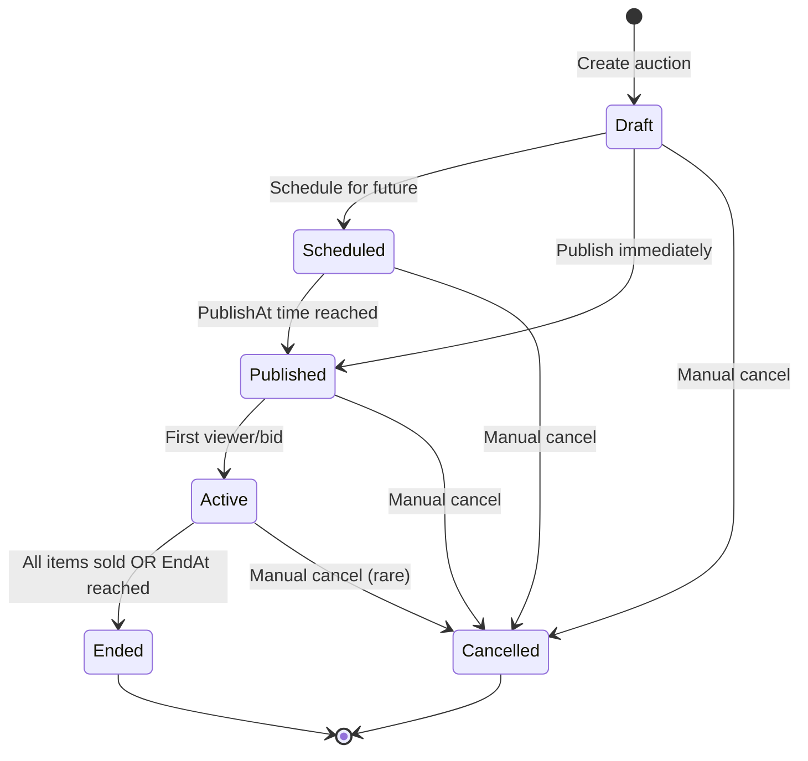
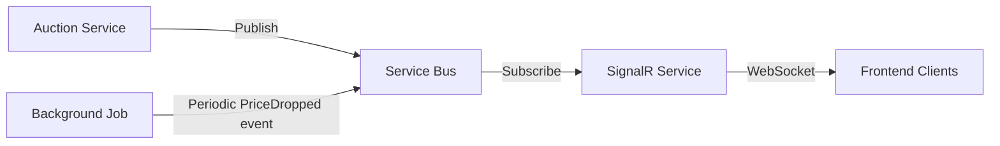

# Auction Context - Overview

## Responsibility

**HEART OF THE SYSTEM** - Zarządzanie mechanizmem aukcji odwrotnej (Dutch Auction) z time-based price drop. Auction Context koordynuje lifecycle aukcji od stworzenia przez publikację, aktywne działanie, aż do zakończenia.

## Business Rules

1. **Time-based Price Drop**: Cena spada precyzyjnie co do sekundy według ustalonego schedule
2. **On-the-fly Calculation**: Aktualna cena jest kalkulowana on-demand based on time elapsed, nie persystowana
3. **Multi-item Support**: Jedna aukcja może mieć wiele InventoryItems, każdy wymaga osobnego bida
4. **Sequential Item Bidding**: Gdy item zostanie kupiony, następny item w kolejce jest dostępny po cenie obliczonej od nowa
5. **Price Boundaries**: Start Price > End Price (minimum), cena nigdy nie spadnie poniżej End Price
6. **Schedule Immutability**: Raz opublikowany schedule nie może być zmieniony (integrity)
7. **Atomic Bid Validation**: Bid musi być walidowany atomically (cena + availability)
8. **Auction Completion**: Aukcja kończy się gdy: wszystkie items sprzedane, osiągnięto end time, lub manual cancellation

## Ubiquitous Language

| Term | Definition |
|------|------------|
| **Auction** | Aggregate root - aukcja odwrotna dla jednego lub wielu items |
| **PriceSchedule** | Konfiguracja spadku ceny: start/end price, drop rate, duration |
| **StartPrice** | Cena początkowa (najwyższa) |
| **EndPrice** | Cena minimalna (poniżej której nie spadnie) |
| **PriceDropRate** | Częstotliwość i wartość spadku (np. 10 PLN co 30 sekund) |
| **CurrentPrice** | Aktualna cena obliczona on-the-fly based on elapsed time |
| **AuctionStatus** | Stan aukcji: Draft, Scheduled, Published, Active, Ended, Cancelled |
| **PublishAt** | Zaplanowana data/czas publikacji aukcji |
| **EndAt** | Zaplanowana data/czas zakończenia aukcji |
| **Bid** | Oferta zakupu przez użytkownika na konkretny item w aukcji |
| **ItemSlot** | Slot dla InventoryItem w aukcji z kolejnością (pozycja 1, 2, 3...) |

## Auction Lifecycle



## Key Scenarios

### 1. Tworzenie Draft Aukcji
```
Given: Sprzedawca ma available InventoryItems
When: Sprzedawca tworzy draft auction
Then: Auction jest utworzona ze statusem Draft
And: Items są przypisane do auction (nie reserved yet)
And: PriceSchedule jest konfigurowany
And: AuctionCreated event jest publishowany
```

### 2. Publikacja Aukcji
```
Given: Auction w statusie Draft lub Scheduled
When: PublishAt time nadchodzi LUB manual publish
Then: Status zmienia się na Published
And: Items są rezervowane (ItemReserved events)
And: AuctionPublished event jest publishowany
And: Auction jest visible dla kupujących
```

### 3. Obliczanie Current Price
```
Given: Published auction z PriceSchedule
When: System/Frontend prosi o current price
Then: Cena jest obliczana on-the-fly:
  CurrentPrice = StartPrice - (ElapsedTime * DropRate)
  Bounded by: max(CalculatedPrice, EndPrice)
And: NO persistence - obliczenie przy każdym zapytaniu
```

### 4. Złożenie Bida
```
Given: Active auction z available item slot
When: Kupujący składa bid z ceną
Then: System waliduje:
  - Czy item slot jest available
  - Czy bid price mieści się w current price range
  - Czy auction nie została cancelled
If valid:
  - Bid jest accepted
  - Item zostaje reserved
  - BidAccepted event jest publishowany
If invalid:
  - BidRejected event jest publishowany
  - Reason jest zwracany
```

### 5. Zakończenie Aukcji
```
Given: Active auction
When: Wszystkie items sprzedane OR EndAt reached
Then: Status zmienia się na Ended
And: AuctionEnded event jest publishowany
And: Niewykorzystane items są released (if any)
```

## Integration Points

### Upstream
- **Inventory Context**: Auction trzyma references do InventoryItemIds, subskrybuje ItemWithdrawn events
- **Product Catalog Context**: Dla display purposes (query side), nie direct coupling

### Downstream
- **Bidding Context**: Bidding subskrybuje AuctionStarted, PriceDropped, AuctionEnded events
- **Reservation Context**: Reaguje na BidAccepted event

### Events Published
- `AuctionCreated`
- `AuctionScheduled`
- `AuctionPublished`
- `PriceDropped` (periodic event - co X sekund dla real-time updates)
- `BidPlaced`
- `BidAccepted`
- `BidRejected`
- `ItemSoldInAuction`
- `AuctionEnded`
- `AuctionCancelled`

### Events Subscribed
- `ItemWithdrawn` (from Inventory) → May need to end auction if item unavailable
- `ReservationExpired` (from Inventory) → Item wraca do auction pool

## Non-Functional Requirements

### Performance
- **Current Price Calculation**: Must be < 10ms (in-memory calculation)
- **Bid Validation**: Must be < 100ms (critical path)
- **Concurrent Bids**: Handle 1000+ concurrent bids per auction (optimistic locking)

### Consistency
- **Strong consistency** w ramach Auction aggregate
- **Optimistic locking** dla bid placement (prevent double-bid)
- **Eventual consistency** dla cross-context updates (events)

### Scalability
- **Stateless calculation** - current price calculated on-demand, nie persystowany
- **Horizontal scaling** - każda auction instance niezależna
- **CQRS**: Read side może być aggressively cached

### Real-time Requirements
- **WebSocket/SignalR** dla push updates:
  - Current price updates (co 5-10 sekund)
  - Bid acceptance notifications
  - Viewer count updates
- **Sub-second latency** dla price updates

### Reliability
- **Idempotent bid processing** - ten sam bid może być received twice
- **Graceful degradation** - jeśli Inventory unavailable, queue bid for later
- **Audit trail** - wszystkie bids muszą być logged (nawet rejected)

## Technical Considerations

### Storage
- Primary: Azure SQL (ACID dla bid validation)
- Cache: Redis dla current price cache (short TTL: 5-10 sec)
- Event Store: Audit trail dla wszystkich bid attempts

### Price Calculation Strategy
**On-the-fly calculation** (NO persistence of intermediate prices):

Advantages:
- No storage overhead
- No price update jobs
- Deterministic calculation
- Easy to test

Trade-offs:
- Must recalculate on every query
- Clock drift considerations (use UTC everywhere)

### Concurrency Control
```csharp
// Optimistic locking na Auction aggregate
public class Auction 
{
    public long Version { get; private set; }
    
    // Bid placement requires version check
    public Result<Bid> PlaceBid(...)
    {
        // Logic...
        Version++; // Increment on successful bid
    }
}
```

### Real-time Updates Architecture


**PriceDropped Event**: Background job publishuje co N sekund dla real-time frontend updates

### Multi-item Auction Strategy

**Option 1: Sequential Slots** (Chosen for MVP)
- Items mają order: Item1, Item2, Item3
- Gdy Item1 sold → Item2 becomes available
- Item2 price starts fresh from StartPrice

**Option 2: Parallel Slots** (Future consideration)
- Wszystkie items available simultaneously
- Każdy ma własny price schedule
- First-come-first-served

MVP uses **Option 1** dla simplicity.

## Bounded Context Size

**Medium complexity** - Auction Context ma:
- Core domain logic (price calculation, bid validation)
- Koordynacja z Inventory i Bidding
- Real-time requirements
- High performance requirements

Ale jest **focused** - nie zajmuje się inventory management, user management, payments.

## Business Invariants (Critical)

1. **No double-bidding**: Jeden item nie może być sprzedany dwukrotnie
2. **Price integrity**: Current price zawsze między StartPrice a EndPrice
3. **Time integrity**: Auction nie może być active przed PublishAt lub po EndAt
4. **Item ownership**: Wszystkie items w auction muszą należeć do tego samego tenanta
5. **Schedule immutability**: Published auction schedule nie może być zmieniony

## Edge Cases to Handle

### Clock Drift
- Zawsze używaj UTC
- NTP synchronization na serwerach
- Bid validation z tolerance window (±1 second)

### Concurrent Bids na ostatni item
- Optimistic locking
- First successful commit wins
- Others otrzymują BidRejected

### Auction Published ale brak viewers
- Status pozostaje Published (nie Active)
- Price drops according to schedule
- First viewer/bid → Active

### Item Withdrawn podczas Active Auction
- Jeśli to ostatni item → End auction
- Jeśli są inne items → Continue z remaining items

### Network Partition podczas Bid
- Bid może być retried przez client
- Idempotency check based on BidId
- Duplicate bids ignored

## Future Enhancements (Out of Scope for MVP)

- **Reserve Price**: Cena, poniżej której sprzedawca nie chce sprzedać (confidential)
- **Buy Now Price**: Opcja immediate purchase po higher price
- **Bid History**: Public history of all bids (transparency)
- **Auto-bid**: Użytkownik ustawia max price, system biduje automatically
- **Auction Extensions**: Extend time if bid w ostatnich sekundach
