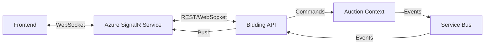

# Bidding Context - Overview

## Responsibility

Zarządzanie procesem składania ofert zakupu (bids) przez użytkowników. Bidding Context zajmuje się user-facing stroną bidowania: przyjmowanie bids od użytkowników, tracking viewer count, real-time notifications.

**Key Distinction**: 
- **Auction Context**: Waliduje i accepts bids (business rules)
- **Bidding Context**: Obsługuje user interactions i notifications

## Business Rules

1. **One Bid Per Item**: Użytkownik może złożyć bid na konkretny item w aukcji
2. **Price Awareness**: Frontend pokazuje current price, użytkownik bidu je na tę cenę
3. **Idempotency**: Ten sam bid (BidId) może być submitted multiple times (network retry)
4. **Viewer Tracking**: System śledzi ile osób obecnie ogląda aukcję
5. **Real-time Notifications**: Użytkownicy dostają instant feedback na bids i price changes
6. **Bid History**: Opcjonalnie: historia wszystkich bids dla transparency

## Ubiquitous Language

| Term | Definition |
|------|------------|
| **Bid** | Oferta zakupu konkretnego item w aukcji po określonej cenie |
| **BidAttempt** | Próba złożenia bida (może być rejected) |
| **ViewerSession** | Sesja użytkownika oglądającego aukcję |
| **ActiveViewers** | Liczba użytkowników obecnie oglądających aukcję |
| **BidFeedback** | Odpowiedź systemu na bid (accepted/rejected + reason) |

## Key Scenarios

### 1. Użytkownik składa bid
```
Given: Użytkownik ogląda active auction
And: Widzi current price 950 PLN
When: Użytkownik klika "Buy Now"
Then: Bid jest wysłany do backendu z ceną 950 PLN
And: PlaceBid command jest wysłane do Auction Context
And: Użytkownik czeka na response (loading state)
```

### 2. Bid zostaje zaakceptowany
```
Given: Valid bid w price range
When: Auction Context accepts bid
Then: BidAccepted event jest publishowany
And: Użytkownik otrzymuje success notification
And: Redirect do checkout flow
And: Inni viewers dostają "Item sold!" notification
```

### 3. Bid zostaje odrzucony
```
Given: Bid poza valid price range (network latency)
When: Auction Context rejects bid
Then: BidRejected event jest publishowany
And: Użytkownik otrzymuje error message z reason
And: Może spróbować ponownie z updated price
```

### 4. Tracking viewers
```
Given: Użytkownik otwiera stronę aukcji
When: WebSocket connection established
Then: ViewerSession jest utworzona
And: ActiveViewers count jest incrementowany
And: Wszyscy viewers dostają update "X people watching"
When: Użytkownik zamyka stronę
Then: ViewerSession jest zakończona
And: ActiveViewers count jest decrementowany
```

## Integration Points

### Upstream
- **Auction Context**: Bidding subskrybuje AuctionPublished, PriceDropped, BidAccepted, BidRejected events
- **Identity Context**: UserId dla bid attribution

### Downstream
- **Real-time Updates (SignalR)**: Pushe notifications do connected clients
- **Frontend**: WebSocket/SignalR dla bidirectional communication

### Commands Sent
- `PlaceBid` → Auction Context

### Events Subscribed
- `AuctionPublished` (from Auction) → Start tracking viewers
- `PriceDropped` (from Auction) → Notify viewers of price update
- `BidAccepted` (from Auction) → Notify winner + other viewers
- `BidRejected` (from Auction) → Notify bidder of rejection
- `ItemSoldInAuction` (from Auction) → Update UI
- `AuctionEnded` (from Auction) → Stop tracking, notify viewers

### Events Published
- `ViewerJoined`
- `ViewerLeft`
- `ActiveViewersCountChanged`

## Non-Functional Requirements

### Performance
- **Bid Submission**: < 200ms round-trip (user click → server response)
- **Real-time Updates**: < 500ms latency (event → client notification)
- **Viewer Tracking**: Handle 10,000+ concurrent viewers per auction

### Scalability
- **Horizontal Scaling**: SignalR service dla connection management
- **Stateless**: Bid submission logic stateless (może być load balanced)
- **Connection Pooling**: Azure SignalR Service handles connections

### Reliability
- **Idempotent Bids**: Same BidId może być retried
- **Graceful Degradation**: Jeśli SignalR unavailable, fall back to polling
- **Connection Resilience**: Auto-reconnect on disconnect

## Technical Considerations

### SignalR Architecture



### SignalR Hub

```csharp
public class AuctionHub : Hub
{
    // Join auction group
    public async Task JoinAuction(Guid auctionId)
    {
        await Groups.AddToGroupAsync(Context.ConnectionId, $"auction-{auctionId}");
        
        // Track viewer
        await _viewerTracker.AddViewerAsync(auctionId, Context.ConnectionId);
    }
    
    // Leave auction group
    public async Task LeaveAuction(Guid auctionId)
    {
        await Groups.RemoveFromGroupAsync(Context.ConnectionId, $"auction-{auctionId}");
        
        // Untrack viewer
        await _viewerTracker.RemoveViewerAsync(auctionId, Context.ConnectionId);
    }
    
    // Disconnection handling
    public override async Task OnDisconnectedAsync(Exception exception)
    {
        await _viewerTracker.HandleDisconnectAsync(Context.ConnectionId);
        await base.OnDisconnectedAsync(exception);
    }
}
```

### Viewer Tracking Storage

**Redis** dla fast in-memory tracking:

```csharp
public class RedisViewerTracker
{
    private readonly IConnectionMultiplexer _redis;
    
    public async Task AddViewerAsync(Guid auctionId, string connectionId)
    {
        var key = $"auction:{auctionId}:viewers";
        await _redis.GetDatabase().SetAddAsync(key, connectionId);
        
        // Publish count update
        var count = await GetViewerCountAsync(auctionId);
        await PublishViewerCountAsync(auctionId, count);
    }
    
    public async Task<int> GetViewerCountAsync(Guid auctionId)
    {
        var key = $"auction:{auctionId}:viewers";
        return (int)await _redis.GetDatabase().SetLengthAsync(key);
    }
}
```

### Bid Idempotency

```csharp
public class BidService
{
    public async Task<BidResult> PlaceBidAsync(PlaceBidCommand command)
    {
        // Check if this BidId already processed
        var existing = await _bidRepository.GetByIdAsync(command.BidId);
        if (existing != null)
        {
            // Idempotent: return previous result
            return existing.Result;
        }
        
        // New bid: process
        var bid = new BidAttempt(
            command.BidId,
            command.AuctionId,
            command.UserId,
            command.BidPrice,
            DateTime.UtcNow);
        
        await _bidRepository.SaveAsync(bid);
        
        // Send command to Auction Context
        await _commandBus.SendAsync(new AcceptBidCommand
        {
            BidId = command.BidId,
            AuctionId = command.AuctionId,
            UserId = command.UserId,
            BidPrice = command.BidPrice
        });
        
        // Wait for result (event)
        return await WaitForBidResultAsync(command.BidId, TimeSpan.FromSeconds(5));
    }
}
```

## Bounded Context Size

**Small & Focused** - Bidding Context ma wąską odpowiedzialność:
- Accept bid submissions from users
- Track viewer count
- Push real-time updates

Nie zajmuje się: bid validation (Auction), checkout (Reservation), inventory (Inventory).

## Edge Cases

### Network Retry
```
User clicks "Buy" → Network timeout → User clicks "Buy" again
Solution: Same BidId used, idempotency check prevents double-bid
```

### Stale Price Display
```
User sees price 950 PLN → Network lag → Price actually 940 PLN
Solution: Tolerance window in Auction Context validation
```

### Connection Drop During Bid
```
User submits bid → WebSocket disconnects → Result unknown
Solution: Frontend polls for bid status using BidId
```

### Viewer Count Accuracy
```
User closes tab without graceful disconnect → Viewer not removed
Solution: Connection timeout + periodic cleanup job
```

## Future Enhancements

### Bid History (Public Transparency)
Show all bids publicly dla trust/transparency:
```
12:30:15 - User123 bid 950 PLN - Accepted ✓
12:30:20 - User456 bid 945 PLN - Rejected (too low)
12:30:25 - User789 bid 940 PLN - Accepted ✓
```

### Auto-bidding
User sets max price, system automatically bids:
```
User: "I'll pay up to 900 PLN"
System: Waits until price drops to 900 PLN, auto-bids
```

### Bid Queues (for high-demand auctions)
Multiple users bid simultaneously → queue system
