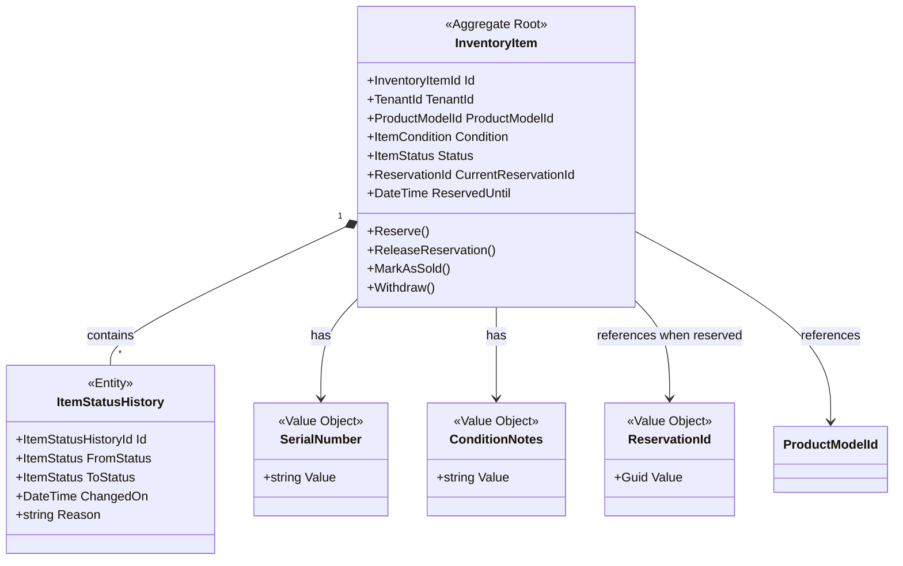

# Inventory Context - Domain Model

## Aggregates

### InventoryItem (Aggregate Root)

**Responsibility**: Reprezentacja konkretnego fizycznego egzemplarza produktu

```csharp
public sealed class InventoryItem : AggregateRoot<InventoryItemId>
{
    public TenantId TenantId { get; private set; }
    public ProductModelId ProductModelId { get; private set; }
    public SerialNumber? SerialNumber { get; private set; } // Optional
    public InternalSKU InternalSKU { get; private set; } // Tenant-specific SKU
    
    public ItemCondition Condition { get; private set; }
    public ConditionNotes? ConditionNotes { get; private set; }
    
    public ItemStatus Status { get; private set; }
    public ReservationId? CurrentReservationId { get; private set; }
    public DateTime? ReservedUntil { get; private set; }
    public UserId? ReservedBy { get; private set; }
    
    public Money AcquisitionCost { get; private set; } // What it cost to acquire
    public DateTime AddedOn { get; private set; }
    public DateTime? SoldOn { get; private set; }
    
    public long Version { get; private set; } // Optimistic locking
    
    private readonly List<ItemStatusHistory> _statusHistory = new();
    public IReadOnlyCollection<ItemStatusHistory> StatusHistory => _statusHistory.AsReadOnly();
    
    // Factory
    public static InventoryItem Create(
        TenantId tenantId,
        ProductModelId productModelId,
        ItemCondition condition,
        ConditionNotes? conditionNotes,
        Money acquisitionCost,
        SerialNumber? serialNumber = null,
        InternalSKU? internalSKU = null);
    
    // Commands
    public void Reserve(
        ReservationId reservationId, 
        UserId userId, 
        TimeSpan reservationDuration);
    
    public void ReleaseReservation(string reason);
    
    public void MarkAsSold(UserId buyerId, Money soldPrice);
    
    public void Withdraw(WithdrawalReason reason, string notes);
    
    public void ReturnToStock(); // From Withdrawn back to Available (rare)
    
    public void UpdateCondition(
        ItemCondition newCondition, 
        ConditionNotes? newNotes);
    
    // Queries
    public bool IsAvailable() => Status == ItemStatus.Available;
    
    public bool IsReserved() => Status == ItemStatus.Reserved;
    
    public bool IsReservationExpired()
    {
        if (!IsReserved() || !ReservedUntil.HasValue)
            return false;
        
        return DateTime.UtcNow > ReservedUntil.Value;
    }
    
    // Invariants
    private void EnsureAvailable(); // Throws if not Available
    
    private void EnsureReserved(); // Throws if not Reserved
    
    private void EnsureNotSold(); // Throws if Sold
    
    private void EnsureReservationValid(ReservationId reservationId);
    
    private void RecordStatusChange(
        ItemStatus oldStatus, 
        ItemStatus newStatus, 
        string reason);
}
```

**Invariants**:
- ProductModelId must reference existing ProductModel
- Cannot reserve already reserved item (optimistic locking prevents this)
- Cannot sell non-reserved item
- Cannot modify sold item
- Reservation must have positive duration
- SerialNumber must be unique per tenant (if provided)
- AcquisitionCost must be positive

**Domain Events**:
- `InventoryItemAdded`
- `ItemReserved`
- `ReservationReleased`
- `ReservationExpired`
- `ItemSold`
- `ItemWithdrawn`
- `ItemReturnedToStock`
- `ItemConditionUpdated`

---

## Entities

### ItemStatusHistory (Entity)

**Responsibility**: Audit trail zmian statusu InventoryItem

```csharp
public sealed class ItemStatusHistory : Entity<ItemStatusHistoryId>
{
    public ItemStatus FromStatus { get; private set; }
    public ItemStatus ToStatus { get; private set; }
    public string Reason { get; private set; }
    public DateTime ChangedOn { get; private set; }
    public UserId? ChangedBy { get; private set; }
    
    internal static ItemStatusHistory Create(
        ItemStatus fromStatus,
        ItemStatus toStatus,
        string reason,
        UserId? changedBy = null);
}
```

**Note**: Entity bo ma identity i jest mutable (ale praktycznie immutable po creation)

---

## Value Objects

### SerialNumber

```csharp
public sealed class SerialNumber : ValueObject
{
    public string Value { get; }
    
    private SerialNumber(string value)
    {
        // Invariants:
        // - Not null or empty
        // - 5-100 characters
        // - Alphanumeric + dash/underscore
        // - No whitespace
        Value = value;
    }
    
    public static SerialNumber From(string value);
    
    protected override IEnumerable<object> GetEqualityComponents()
    {
        yield return Value;
    }
}
```

### InternalSKU

```csharp
public sealed class InternalSKU : ValueObject
{
    public string Value { get; }
    
    private InternalSKU(string value)
    {
        // Invariants:
        // - Not null or empty
        // - Max 50 characters
        // - Alphanumeric + dash/underscore
        // - Format: tenant-defined (flexible)
        Value = value;
    }
    
    public static InternalSKU From(string value);
    public static InternalSKU Generate(TenantId tenantId, ProductModelId productModelId);
}
```

### ConditionNotes

```csharp
public sealed class ConditionNotes : ValueObject
{
    public string Value { get; }
    
    private ConditionNotes(string value)
    {
        // Invariants:
        // - Can be empty
        // - Max 1000 characters
        // - Plain text (no HTML)
        Value = value;
    }
    
    public static ConditionNotes From(string value);
    public static ConditionNotes Empty();
}
```

### ReservationId

```csharp
public sealed class ReservationId : ValueObject
{
    public Guid Value { get; }
    
    private ReservationId(Guid value)
    {
        if (value == Guid.Empty)
            throw new ArgumentException("ReservationId cannot be empty");
        
        Value = value;
    }
    
    public static ReservationId Create();
    public static ReservationId From(Guid value);
}
```

**Note**: ReservationId może być shared z Reservation Context (w Shared Kernel)

---

## Enums

### ItemStatus

```csharp
public enum ItemStatus
{
    Available,   // Ready to be auctioned/sold
    Reserved,    // Temporarily reserved (auction bid/checkout)
    Sold,        // Permanently sold
    Withdrawn    // Removed from availability (damaged, returned to supplier)
}
```

### ItemCondition

```csharp
public enum ItemCondition
{
    New,           // Brand new, factory sealed
    Unpacked,      // Opened but unused, perfect condition
    Display,       // Used as display model, minor wear
    Refurbished,   // Repaired/restored to working condition
    Damaged        // Has defects, sold as-is
}
```

**Note**: Condition wpływa na wartość i atrakcyjność dla kupujących

### WithdrawalReason

```csharp
public enum WithdrawalReason
{
    Damaged,           // Item was damaged
    ReturnedToSupplier, // Sent back to supplier
    QualityIssue,      // Failed quality check
    LostOrStolen,      // Cannot locate item
    Other              // Other reason (see notes)
}
```

---

## Domain Services

### ReservationTimeoutService

**Responsibility**: Sprawdzanie wygasłych rezerwacji i zwracanie items do Available

```csharp
public sealed class ReservationTimeoutService
{
    // Finds all items with expired reservations
    public IEnumerable<InventoryItemId> FindExpiredReservations();
    
    // Processes expired reservation for an item
    public void ProcessExpiredReservation(InventoryItem item);
}
```

**Implementation Note**: 
- To może być Background Job (Azure Function, Hangfire)
- Alternative: Event-driven z delayed messages (Service Bus)

---

### InventoryAvailabilityService

**Responsibility**: Queries dla dostępności items (read side)

```csharp
public interface IInventoryAvailabilityService
{
    // Get available items for a product model
    Task<IEnumerable<InventoryItemId>> GetAvailableItemsAsync(
        TenantId tenantId, 
        ProductModelId productModelId);
    
    // Check if specific item is available
    Task<bool> IsItemAvailableAsync(InventoryItemId itemId);
    
    // Get count of available items per condition
    Task<Dictionary<ItemCondition, int>> GetAvailabilityByConditionAsync(
        TenantId tenantId,
        ProductModelId productModelId);
}
```

**Note**: To może być query service (CQRS read side), nie domain service

---

## Aggregate Diagram



---

## Validation Rules

### At Creation
- TenantId must reference existing tenant
- ProductModelId must reference existing ProductModel
- AcquisitionCost must be positive
- SerialNumber must be unique per tenant (if provided)
- ConditionNotes max 1000 characters

### At Reservation
- Item must be Available
- Reservation duration must be positive (min 1 minute, max 24 hours)
- UserId must be valid
- Optimistic locking check (Version field)

### At Sale
- Item must be Reserved
- ReservationId must match current reservation
- SoldPrice must be positive

### At Withdrawal
- Item must not be Sold
- Reason must be provided

### Cross-Aggregate Rules
- Cannot reserve item that doesn't belong to tenant
- Cannot sell item from different tenant
- SerialNumber uniqueness enforced at database level (unique constraint)

---

## Concurrency Handling

### Optimistic Locking Example

```csharp
public class InventoryItemRepository
{
    public async Task SaveAsync(InventoryItem item)
    {
        try
        {
            // EF Core: Uses [ConcurrencyCheck] on Version field
            await _dbContext.SaveChangesAsync();
            
            // Increment version after successful save
            item.IncrementVersion();
        }
        catch (DbUpdateConcurrencyException)
        {
            throw new ConcurrencyException(
                $"InventoryItem {item.Id} was modified by another process");
        }
    }
}
```

### Retry Policy for Commands

```csharp
public class ReserveItemCommandHandler
{
    public async Task HandleAsync(ReserveItemCommand command)
    {
        var retryPolicy = Policy
            .Handle<ConcurrencyException>()
            .RetryAsync(3, onRetry: (ex, retryCount) => 
            {
                // Log retry attempt
            });
        
        await retryPolicy.ExecuteAsync(async () =>
        {
            var item = await _repository.GetByIdAsync(command.ItemId);
            item.Reserve(command.ReservationId, command.UserId, command.Duration);
            await _repository.SaveAsync(item);
        });
    }
}
```

---

## Performance Considerations

### Indexing Strategy
- Index on (TenantId, Status) for availability queries
- Index on (TenantId, ProductModelId, Status) for product-specific availability
- Index on (SerialNumber) unique for lookups
- Index on (ReservedUntil) for timeout processing

### Caching
- Cache availability counts per ProductModel (invalidate on status change)
- Short TTL cache for "IsAvailable" queries (1-5 minutes)

### Read Model Denormalization (CQRS)
```csharp
public class InventoryAvailabilityReadModel
{
    public Guid TenantId { get; set; }
    public Guid ProductModelId { get; set; }
    public ItemCondition Condition { get; set; }
    public int AvailableCount { get; set; }
    public int ReservedCount { get; set; }
    public int SoldCount { get; set; }
    
    // Updated via event handlers
}
```
