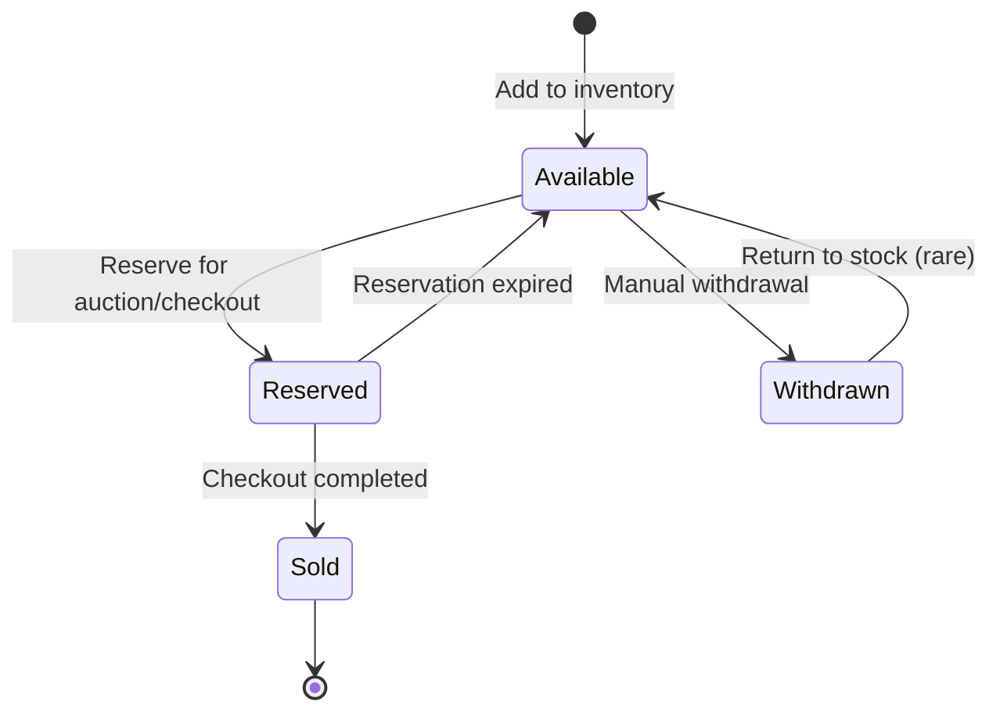

# Inventory Context - Overview

## Responsibility

Zarządzanie **konkretnymi fizycznymi egzemplarzami** produktów (InventoryItems). Każdy InventoryItem to unikalny egzemplarz (np. konkretny telewizor Samsung z określonym stanem: nowy/rozpakowany/wystawowy).

**Key Distinction**: 
- ProductModel (Product Catalog) = "Samsung XC1575C jako model"
- InventoryItem (Inventory) = "Konkretny egzemplarz Samsung XC1575C, serial ABC123, rozpakowany"

## Business Rules

1. **Item Uniqueness**: Każdy InventoryItem jest unikalny (serial number lub internal ID)
2. **State Tracking**: Item może być: Available, Reserved, Sold, Withdrawn
3. **Condition Tracking**: Stan fizyczny: New, Unpacked, Display, Refurbished, Damaged
4. **Tenant Isolation**: InventoryItems należą do konkretnego tenanta
5. **Reservation Timeout**: Zarezerwowany item wraca do Available po timeout (np. 15 minut)
6. **Immutable History**: Historia zmian stanu jest zapisywana (audit trail)

## Ubiquitous Language

| Term | Definition |
|------|------------|
| **InventoryItem** | Konkretny fizyczny egzemplarz produktu z określonym stanem i kondycją |
| **ItemCondition** | Stan fizyczny produktu (New, Unpacked, Display, Refurbished, Damaged) |
| **ItemStatus** | Status dostępności (Available, Reserved, Sold, Withdrawn) |
| **SerialNumber** | Unikalny numer identyfikacyjny fizycznego egzemplarza (opcjonalny) |
| **ConditionNotes** | Szczegółowe notatki o stanie egzemplarza (np. "drobne rysy na obudowie") |
| **Reservation** | Tymczasowe zablokowanie itemu dla konkretnego użytkownika z timeout |
| **Withdrawal** | Usunięcie itemu z dostępnych (np. uszkodzenie, zwrot do dostawcy) |

## Key Scenarios

### 1. Dodanie nowego InventoryItem do stock
```
Given: ProductModel istnieje w katalogu
When: Sprzedawca dodaje nowy InventoryItem
Then: InventoryItem jest utworzony ze statusem Available
And: Item jest przypisany do ProductModel
And: InventoryItemAdded event jest publishowany
```

### 2. Rezerwacja itemu dla aukcji
```
Given: InventoryItem ze statusem Available
When: Auction System wywołuje ReserveForAuction
Then: Status zmienia się na Reserved
And: ReservationId jest przypisane
And: Timeout jest ustawiony
And: ItemReserved event jest publishowany
```

### 3. Finalizacja sprzedaży
```
Given: InventoryItem ze statusem Reserved
When: Checkout jest completed
Then: Status zmienia się na Sold
And: ItemSold event jest publishowany
And: Item nie jest już dostępny dla innych aukcji
```

### 4. Timeout rezerwacji
```
Given: InventoryItem ze statusem Reserved
When: Reservation timeout wygasa
Then: Status wraca do Available
And: ReservationId jest czyszczone
And: ReservationExpired event jest publishowany
And: Item może być ponownie wystawiony na aukcji
```

### 5. Wycofanie itemu
```
Given: InventoryItem ze statusem Available
When: Sprzedawca wycofuje item (uszkodzenie, zwrot)
Then: Status zmienia się na Withdrawn
And: Reason jest zapisany
And: ItemWithdrawn event jest publishowany
```

## Integration Points

### Upstream
- **Product Catalog Context**: Reference do ProductModelId (item jest instancją modelu)
- **Tenant Management Context**: TenantId dla ownership

### Downstream
- **Auction Context**: Auction trzyma reference InventoryItemId
- **Reservation Context**: Reservation operuje na InventoryItem

### Events Published
- `InventoryItemAdded`
- `ItemReserved`
- `ReservationExpired`
- `ItemSold`
- `ItemWithdrawn`
- `ItemConditionUpdated`

### Events Subscribed
- `BidAccepted` (from Auction) → Reserve item
- `CheckoutCompleted` (from Reservation) → Mark as Sold
- `CheckoutCancelled` (from Reservation) → Release reservation

## State Machine: ItemStatus



## Non-Functional Requirements

### Consistency
- **Strong consistency** w ramach InventoryItem aggregate
- **Eventual consistency** dla cross-aggregate operations (via events)

### Concurrency
- **Optimistic locking** dla prevent double-reservation
- Version field na aggregate

### Performance
- Read-heavy dla auction listing (pokazywanie dostępnych items)
- Write spikes podczas popularnych aukcji

### Scalability
- Partition by TenantId
- CQRS: oddzielny read model dla fast queries

### Audit Trail
- Każda zmiana stanu powinna być zalogowana (audit log)
- Event Sourcing consideration dla pełnej historii

## Technical Considerations

### Storage
- Primary: Azure SQL (ACID transactions dla reservation)
- Read Model: Cosmos DB dla fast queries (dostępne items per category)
- Audit Log: Append-only table lub Event Store

### Concurrency Control
```csharp
// Optimistic locking
public class InventoryItem 
{
    public long Version { get; private set; }
    
    // EF Core: [Timestamp] lub [ConcurrencyCheck]
}
```

### Reservation Timeout Handling
- Background job sprawdza expired reservations co X sekund
- Azure Functions Time Trigger lub Hangfire
- Alternative: Event-driven z delayed message (Service Bus ScheduledEnqueueTimeUtc)

### Multi-tenancy
- TenantId jako partition key
- Row-level security
- Isolated per tenant (żaden tenant nie widzi items innych tenantów)

## Bounded Context Size

**Small & Focused** - Inventory Context ma wąską odpowiedzialność:
- Dodawanie items
- Tracking stanu i kondycji
- Rezerwacja/zwolnienie
- Nie zajmuje się: aukcjami, płatnościami, shipping

## Future Considerations

### Warehouse Management (Out of Scope for MVP)
- Multiple warehouse locations
- Item tracking per location
- Transfer between warehouses

### Returns & Refunds (Out of Scope for MVP)
- Return to inventory
- Refurbishment workflow
- Quality check process
