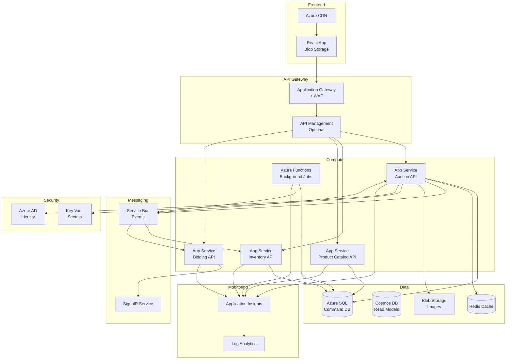

# Azure Infrastructure Overview

## High-Level Architecture



---

## Resource Groups

### Suggested Structure

```
rg-reverseauction-prod-westeurope
├── Compute
│   ├── app-auction-api-prod
│   ├── app-inventory-api-prod
│   ├── app-productcatalog-api-prod
│   ├── app-bidding-api-prod
│   └── func-backgroundjobs-prod
├── Data
│   ├── sql-reverseauction-prod
│   │   ├── AuctionDB
│   │   ├── InventoryDB
│   │   └── ProductCatalogDB
│   ├── cosmos-readmodels-prod
│   ├── redis-reverseauction-prod
│   └── storageaccount-prod (Blob)
├── Messaging
│   ├── sb-reverseauction-prod (Service Bus)
│   └── signalr-reverseauction-prod
├── Security
│   ├── kv-reverseauction-prod (Key Vault)
│   └── AAD (Tenant-level)
├── Networking
│   ├── vnet-reverseauction-prod (Optional)
│   ├── appgw-reverseauction-prod (App Gateway)
│   └── cdn-reverseauction-prod
└── Monitoring
    ├── appi-reverseauction-prod (App Insights)
    └── log-reverseauction-prod (Log Analytics)
```

---

## Environments

### Recommended Setup

1. **Development** (`rg-reverseauction-dev`)
   - Shared dev resources
   - Lower SKUs (Basic/Standard)
   - Developer access

2. **Staging** (`rg-reverseauction-staging`)
   - Production-like configuration
   - Testing before prod deployment
   - Limited access

3. **Production** (`rg-reverseauction-prod`)
   - Full HA configuration
   - Premium SKUs
   - Restricted access
   - Geo-redundancy (optional)

---

## Deployment Regions

**Primary**: West Europe (Amsterdam)
**Secondary** (optional dla HA): North Europe (Dublin)

---

## Cost Optimization

### Development
- Use Basic/Standard tiers
- Single instance
- No geo-replication
- Estimated: $500-800/month

### Production (MVP)
- Standard tiers
- Auto-scaling (2-5 instances)
- Redis Standard
- SignalR Standard
- Estimated: $2000-3000/month

### Production (Scale)
- Premium tiers
- Auto-scaling (5-20 instances)
- Geo-replication
- Cosmos DB
- Estimated: $5000-10000/month

---

## Backup & DR

### Azure SQL
- Automated backups (7-35 days retention)
- Point-in-time restore
- Geo-replication dla DR

### Blob Storage
- LRS (Locally Redundant) dla dev
- GRS (Geo-Redundant) dla prod
- Lifecycle policies (move to cool tier)

### Application Code
- Source control (Git)
- Deployment slots dla rollback

---

## Scaling Strategy

### Horizontal Scaling
- App Services: 2-10 instances based on CPU
- Azure Functions: Consumption plan (auto-scale)
- SignalR: Standard tier (auto-scale)

### Vertical Scaling
- Database: Scale up tier as needed
- Redis: Upgrade to Premium dla HA

---

## Security

### Network Security
- App Gateway with WAF (Web Application Firewall)
- Private endpoints dla databases (optional)
- VNet integration (optional)

### Secrets Management
- All secrets in Key Vault
- Managed Identity dla access
- No secrets in code/config

### Authentication
- Azure AD dla admin users
- JWT tokens dla API authentication

---

## Monitoring & Alerts

### Application Insights
- Performance monitoring
- Request tracking
- Failure tracking
- Custom metrics

### Alerts
- CPU > 80% → Scale out
- Error rate > 5% → Page on-call
- Database DTU > 80% → Scale up
- SignalR connections > 80% capacity → Upgrade tier

---

## Deployment Pipeline

```
Code Push → GitHub/Azure DevOps
    ↓
Build Pipeline
    ↓
Unit Tests
    ↓
Docker Image (optional)
    ↓
Deploy to Staging
    ↓
Integration Tests
    ↓
Manual Approval
    ↓
Deploy to Production (Blue-Green)
    ↓
Smoke Tests
    ↓
Swap Slots
```

---

## Infrastructure as Code

**Terraform** or **Azure Bicep** dla reproducible infrastructure

```hcl
# Example Terraform
resource "azurerm_app_service" "auction_api" {
  name                = "app-auction-api-prod"
  location            = "westeurope"
  resource_group_name = azurerm_resource_group.main.name
  app_service_plan_id = azurerm_app_service_plan.main.id
  
  app_settings = {
    "APPINSIGHTS_INSTRUMENTATIONKEY" = azurerm_application_insights.main.instrumentation_key
    "ServiceBus__ConnectionString"   = "@Microsoft.KeyVault(SecretUri=${azurerm_key_vault_secret.servicebus.id})"
  }
}
```
